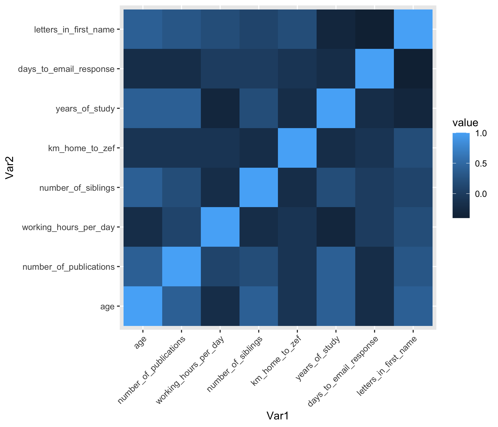

## Data Visualization

If you ever get stuck

- **Open RStudio**
{width=1in}

- type ‘?’ in R console with function, package or data name
- Add “R” to a search with a copy of an error message

- **Help > Cheatsheets > Data Visualization with ggplot2**

For getting help

- Many talented programmers 
- Some scan the web and answer issues

```{r, out.width='20%', fig.align='center', echo=FALSE}
knitr::include_graphics('images/stack-overflow.png')
```
https://stackoverflow.com

{width=1in}
Hadley Wickham

{width=1in}
Yihui Xie https://yihui.name/en/2017/08/so-gh-email

https://rmarkdown.rstudio.com/

## Getting your data in R

{width=1in}

- Load the data
```{r}
participants_data <- read.csv("participants_data.csv")
```
- Keep your data in the same folder structure as .RProj
- at or below the level of .RProj

## Creating a barplot in base R

**R has several systems for making graphs**

- **Base R** 
- Create a barplot with the `table()` and `barplot()` functions

```{r base_barplot, out.width='20%', fig.align='center'}
parents <- table(participants_data$academic_parents)

barplot(parents)
```
Bar plot of number of observations of binary data related to academic parents

## ggplot2: 'Grammar of Graphics' Overview

{width=1in}


**Many libraries and functions for graphs in R...**

- **ggplot2** is one of the most elegant and most versatile.

- **ggplot** implements the *grammar of graphics* to describe and build graphs. 

- Do more and do it faster by learning one system and applying it in many places.

- Learn more about ggplot2 in “The Layered Grammar of Graphics”

<http://vita.had.co.nz/papers/layered-grammar.pdf>

## ggplot2: names and email


{width=1in}


**Example from your data**

```{r ggplot_name_email, fig.height=2, fig.align='center'}
library(ggplot2)
ggplot(data = participants_data, aes(x=letters_in_first_name, y=days_to_email_response)) + 
  geom_point()
```
Scatterplot of days to email response as a function of the letters in your first name

Want to understand how all the pieces fit together? See the R for Data Science book: http://r4ds.had.co.nz/

## ggplot2: add color and size


{width=1in}


```{r ggplot_color_size, fig.height= 2, fig.align='center'} 
ggplot(data = participants_data, aes(x=letters_in_first_name, y=days_to_email_response, color=academic_parents, size=working_hours_per_day)) + 
  geom_point()
``` 
Scatterplot of letters in your first name as a function of days to email response with colors representing binary data related to academic parents and working hours per day as bubble sizes.

**Make more graphs**

## ggplot2: iris data


{width=1in}


**Example from Anderson's iris data set**

```{r ggplot_iris, fig.height= 2, fig.align='center'}
ggplot(data=iris, aes(x=Sepal.Length, y=Petal.Length, color=Species, size=Petal.Width))+ 
  geom_point()
```
Scatterplot of iris petal length as a function of sepal length with colors representing iris species and petal width as bubble sizes.

## ggplot2: diamonds price


```{r, out.width='70%', fig.align='right', echo=FALSE}
knitr::include_graphics('images/ggplot2.png')
```


**ggplot** accepts formula arguments such as log
```
ggplot(data = diamonds, aes(x=carat, y=price, alpha = 0.2)) + geom_point()
```
```
ggplot(data = diamonds, aes(x=log(carat), y= log(price), alpha = 0.2)) + geom_point()
```
```{r ggplot_carat_price, fig.width=20, fig.height=5, fig.align='center', echo=FALSE} 
plot1 <- ggplot(data = diamonds, aes(x=carat, y=price, alpha = 0.2)) +
  geom_point()
plot2 <- ggplot(data = diamonds, aes(x=log(carat), y= log(price), alpha = 0.2)) + 
  geom_point()
library(gridExtra)
grid.arrange(plot1, plot2, ncol=2)
```

## ggplot2: diamonds color shape


{width=1in}


```{r diamonds_color, fig.show='hide'}
library(dplyr)
dsmall <- top_n(diamonds, n=100)
#Plot with different colors for color
ggplot(data = dsmall, aes(x=carat, y=price, color = color))+ geom_point()
#Plot with different shapes for cut 
ggplot( data = dsmall, aes(carat, price, shape = cut)) + geom_point()
```

```{r ggplot_diamonds_color_shape, fig.height=2, fig.align='center', echo=FALSE} 
library(dplyr)
#Create a sample
dsmall <- dsmall <- top_n(diamonds, n=100)
#Plot with different colors for color
plot3<-ggplot(data = dsmall, aes(x=carat, y=price, color = color))+ geom_point()
#Plot with different shapes for cut 
plot4<-ggplot( data = dsmall, aes(carat, price, shape = cut)) + geom_point()
library(gridExtra)
grid.arrange(plot3, plot4, ncol=2)
```


## ggplot2: set parameters


{width=1in}


Set parameters manually with `I()` *Inhibit Interpretation / Conversion of Objects*
```{r, fig.show = 'hide'}
ggplot(data = diamonds, aes(carat, price, alpha=I(0.1), color=I("blue"))) + geom_point()

ggplot(data = diamonds, aes(carat, price, alpha=I(0.4), color=I("green"))) + geom_point()
```

```{r ggplot_set, fig.width=20, fig.height=2, fig.align='center', echo=FALSE} 
plot5 <- ggplot(data = diamonds, aes(carat, price, alpha=I(0.1), color=I("blue"))) + geom_point()
plot6<-ggplot(data = diamonds, aes(carat, price, alpha=I(0.4), color=I("green"))) + geom_point()
library(gridExtra)
grid.arrange(plot5, plot6, ncol=2)
```


## ggplot2: geom options


{width=1in}


With “geom” different types of plots can be defined e.g. points, line, boxplot, path, smooth. These can also be combined.
```
ggplot(data=dsmall, aes(x=carat, y=price))+
geom_point()+
geom_smooth()
```
```{r ggplot_geom, fig.width=20, fig.height=4, fig.align='center', echo=FALSE} 
#Create a sample
p1 <- ggplot(data=dsmall, aes(x=carat, y=price))+
geom_point()
p2 <- ggplot(data=dsmall, aes(x=carat, y=price))+
geom_smooth()
p3 <- ggplot(data=dsmall, aes(x=carat, y=price))+
geom_smooth()+
geom_point()
library(gridExtra)
grid.arrange(p1, p2, p3, ncol=3)
```


## ggplot2: smooth function


```{r out.width='70%', fig.align='center', echo=FALSE}
knitr::include_graphics('images/ggplot2.png')
```


`geom_smooth()` selects a smoothing method based on the data. Use `method =` to specify your preferred smoothing method.
```
ggplot(data=dsmall, aes(x=carat, y=price))+ geom_point()+ geom_smooth()

ggplot(data=diamonds, aes(x=carat, y=price))+ geom_point()+ 
geom_smooth(method = 'glm')
```

```{r ggplot_smooth, fig.width=20, fig.height=3, fig.align='center', echo=FALSE} 
#Create a sample
pl1 <- ggplot(data=dsmall, aes(x=carat, y=price))+
geom_point()+
geom_smooth()

pl2 <- ggplot(data=diamonds, aes(x=carat, y=price))+
geom_point()+
geom_smooth()

pl3 <- ggplot(data=diamonds, aes(x=carat, y=price))+
geom_point()+
geom_smooth(method = 'glm')

library(gridExtra)
grid.arrange(pl1, pl2, pl3, ncol=3)
```
~~ggplot2 lines and smoothing options~~


## ggplot2: boxplots 


{width=1in}


- Boxplots can be displayed through `geom_boxplot()`. 

```{r ggplot_boxplot, fig.width=20, fig.height=7, fig.align='center'}
ggplot(data=diamonds, aes(x=color, y=price/carat)) + 
geom_boxplot()
```

## ggplot2: jitter points 


{width=1in}


- Jittered plots `geom_jitter()` show all points. 

```{r jitter_plot, fig.width=20, fig.height=5, fig.align='center'}
ggplot(data=diamonds, aes(x=color, y=price/carat)) + 
geom_boxplot()+ 
geom_jitter()
```

## ggplot2: adding alpha 


{width=1in}

In case of overplotting changing `alpha` can help.
```{r boxplot_jitter, fig.width=20, fig.height=5, fig.align='center'}
ggplot(data=diamonds, aes(x=color, y=price/carat, alpha=I(0.1))) + 
geom_boxplot()+ 
geom_jitter()
```

```{r ggplot_box_jitter, fig.width=20, fig.height=5, fig.align='center', echo=FALSE} 

pt1 <- ggplot(data=diamonds, aes(x=color, y=price/carat)) + 
geom_boxplot()

pt2 <- ggplot(data=diamonds, aes(x=color, y=price/carat)) + 
geom_boxplot()+ 
geom_jitter()

pt3 <- ggplot(data=diamonds, aes(x=color, y=price/carat, alpha=I(0.1))) + 
geom_boxplot()+ 
geom_jitter()

library(gridExtra)
grid.arrange(pt1, pt2, pt3, ncol=3)
```


## ggplot2: geom_histogram


{width=1in}


```
ggplot(data = diamonds, aes(x=carat)) +
geom_density()

ggplot(data = diamonds, aes(x=carat, color = color)) +
geom_density()

ggplot(data = diamonds, aes(x=carat, color = color, alpha=I(0.3))) +
geom_density()
```

```{r ggplot_histograms, fig.width=20, fig.height=2, fig.align='center', echo=FALSE} 

pt4 <- ggplot(data = diamonds, aes(x=carat)) +
geom_density()

pt5 <- ggplot(data = diamonds, aes(x=carat, fill = color)) +
geom_density()

pt6 <- ggplot(data = diamonds, aes(x=carat, fill = color, alpha=I(0.3))) +
geom_density()

library(gridExtra)
grid.arrange(pt4, pt5, pt6, ncol=3)
```
~~ggplot2 histograms~~

## ggplot2: subset

{width=1in}

Use factor to subset your data.
```
ggplot(data = mpg, aes(x=displ, y=hwy,  color = cyl))+ 
geom_point()+
geom_smooth(method="lm")

ggplot(data = mpg, aes(x=displ, y=hwy,  color = factor(cyl)))+ 
geom_point()+
geom_smooth(method="lm")
```

```{r ggplot_subset, fig.width=20, fig.height=5, fig.align='center', echo=FALSE} 

plt1 <- ggplot(data = mpg, aes(x=displ, y=hwy,  color = cyl))+ 
geom_point()+
geom_smooth(method="lm")

plt2 <- ggplot(data = mpg, aes(x=displ, y=hwy,  color = factor(cyl)))+ 
geom_point()+
geom_smooth(method="lm")

library(gridExtra)
grid.arrange(plt1, plt2, ncol=2)
```
~~ggplot2 subset with smooth line~~

##  ggplot2: "slow ggplotting"


{width=1in}

for `aes()` in `ggplot()`


- using fewer functions; example - using labs() to add a title instead of ggtitle()
- using functions multiple times; example aes(x = var1) + aes(y = var2) rather than aes(x = var1, y = var2)
- using base R functions and tidyverse functions.  For other packages, the :: style to call them
- write out arguments (no shortcuts)  aes(x = gdppercap) not aes(gdppercap)

<https://evamaerey.github.io/ggplot_flipbook/ggplot_flipbook_xaringan.html#1>

##  ggplot2: not slow example


{width=1in}


ggplot code in non-slow fashion
```{r ggplot_not_slow, fig.width=20, fig.height=5, fig.align='center'}
ggplot(mtcars, aes(mpg, y = hp, col = gear)) +
  geom_point() +
  ggtitle("My Title") +
  labs(x = "the x label", y = "the y label", col = "legend title")
```

## ggplot2: slow ggplotting example

{width=1in}

'Slow ggplotting' version for the same plot
```{r slow_ggplotting_example, fig.width=20, fig.height=4, fig.align='center'}
  ggplot(data = mtcars) +
  aes(x = mpg) +
  labs(x = "the x label") +
  aes(y = hp) +
  labs(y = "the y label") +
  geom_point() +
  aes(col = gear) +
  labs(col = "legend title") +
  labs(title = "My Title")
```

<https://evamaerey.github.io/ggplot_flipbook/ggplot_flipbook_xaringan.html#1>

##  ggplot2: geom_tile


```{r, out.width='80%', fig.align='right', echo=FALSE}
knitr::include_graphics('images/ggplot2.png')
```


- Use `dplyr`, `ggplot2` and `reshape2` 

```
part_data<-select_if(participants_data, is.numeric)

cormat <- round(cor(part_data), 1)
melted_cormat <- melt(cormat)

ggplot(data = melted_cormat, aes(x=Var1, 
y=Var2, fill=value)) + 
geom_tile()
```

```{r geom_melted_cormat, fig.width=12, fig.height=2, fig.align='center', echo=FALSE}
part_data<-select_if(participants_data, is.numeric)

library(reshape2)
cormat <- round(cor(part_data), 1)
melted_cormat <- melt(cormat)

ggplot(data = melted_cormat, aes(x=Var1, 
y=Var2, fill=value)) + 
geom_tile()
```

## Export Figures


```{r fig.width=10, fig.height=10, fig.align='center', echo=FALSE}

```


```
png(file = "cortile.png", width = 7, height = 6, units = "in", res = 300)

ggplot(data = melted_cormat, aes(x = Var1, y = Var2, fill = value)) + geom_tile() + theme(axis.text.x = element_text(angle = 45, hjust = 1))

dev.off()
```

- Check with journal about size, resolution etc.

```{r}
?pdf
```


## gganimate

The datasauRus


```{r, out.width='80%', fig.align='right', echo=FALSE}
knitr::include_graphics('images/gganimate_logo.png')
```


- Use `datasauRus`, `ggplot2` and `gganimate` 

```{r, datasaurus}
library(gganimate)
library(datasauRus)
```

```{r, datasaurus2}
ggplot(datasaurus_dozen, aes(x=x, y=y))+
  geom_point()+
  theme_minimal() +
  transition_states(dataset, 3, 1) + 
  ease_aes('cubic-in-out')
```

## gganimate: Datasaurus Dozen


```{r, out.width='80%', fig.align='right', echo=FALSE}
knitr::include_graphics('images/gganimate_logo.png')
```


```{r animate_datasaurus_dozen, fig.width=12, fig.height=10, fig.align='center', echo=FALSE}
library(datasauRus)
library(ggplot2)
library(gganimate)

ggplot(datasaurus_dozen, aes(x=x, y=y))+
  geom_point()+
  theme_minimal() +
  transition_states(dataset, 3, 1) + 
  ease_aes('cubic-in-out')
```
  
## gganimate: diamonds carat


```{r, out.width='80%', fig.align='right', echo=FALSE}
library(gifski)
library(gganimate)
knitr::include_graphics('images/gganimate_logo.png')
```


- Use `tidyverse`, `ggplot2` and `gganimate`

```{r animate_diamonds, fig.width=12, fig.height=4, fig.align='center'}
ggplot(data = dsmall, aes(x = carat, y = price, color = color)) + 
  geom_line() +
  transition_reveal(carat) + 
  ease_aes("linear") +
  labs(title='Diamond carat: {frame_along}')
```


## Tasks for the afternoon: Basic


```{r, out.width='80%', fig.align='center', echo=FALSE}
knitr::include_graphics('images/ggplot2.png')
```

**Test your new skills**

- Use scatter plots, barcharts and boxplots
- Vary the sample and run the same analysis and plots
- Save your most interesting figure and share it with us tomorrow

##  Tasks for the afternoon: Advanced

```{r, out.width='80%', fig.align='center', echo=FALSE}
knitr::include_graphics('images/ggplot2.png')
```

**Your turn to perform**

- Import data from an external source (e.g. FAO, World Bank)
- Display those data in an interactive plot
- Play around with the design
- Export your most interesting figure and share it with us
