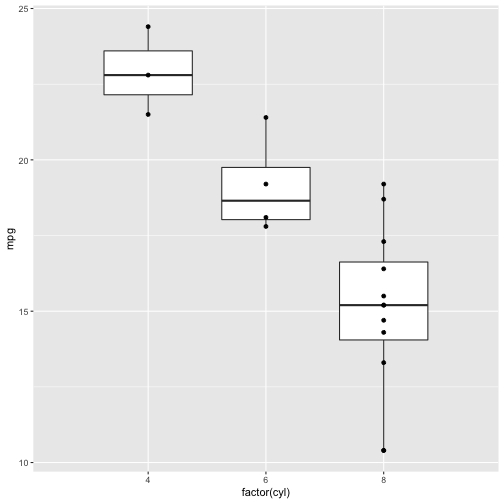

    
Data Visualization
========================================================
author: Cory Whitney
font-family: 'Helvetica'
date: "2019-03-13"
autosize: true
css: mySlideTemplate.css
incremental: true

</small>cory.whitney@uni-bonn.de </small>

Data visualization: getting stuck
========================================================
incremental: true
right: 30%

- open RStudio

- Help > Cheatsheets > Data Visualization with ggplot2

- type ‘?’ in R console with function, package or data name
- Add “R” to a search with a copy of an error message
- Many talented programmers who scan the web and answer issues

</small>https://stackoverflow.com/ </small>

***

Hadley Wickham

Yihui Xie

<small>https://yihui.name/en/2017/08/so-gh-email/</small>

<small>https://rmarkdown.rstudio.com/ </small>

gganimate
========================================================
incremental: true

Tasks for the afternoon: Basic
========================================================
incremental: true

- Check your data for interesting trends and correlations
- Use scatter plots, barcharts and boxplots
- Bootstrap and vary the sample and run the same analysis and plots
- Save your most interesting figure and share it with us the next day

Tasks for the afternoon: Advanced
========================================================
incremental: true

- Import data from an external source (e.g. FAO, World Bank)
- Display those data in an interactive plot
- Play around with the design
- Export your most interesting figure and share it with us tomorrow

Be prepared for tomorrow
========================================================
incremental: true

Install Git & Github (if you do not already have them). 

Git
<small>https://git-scm.com/downloads</small>

Github
<small>http://r-pkgs.had.co.nz/git.html</small>

join Github
<small>https://github.com/</small>

