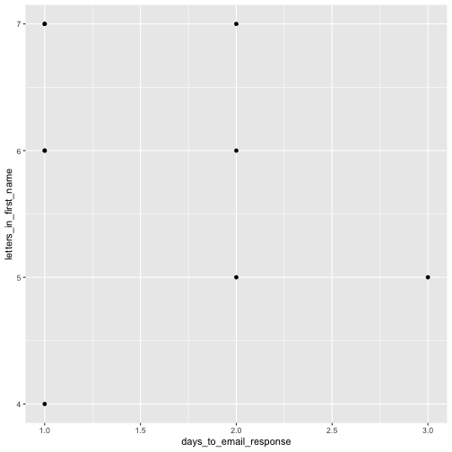

<style>
.section .reveal .state-background {
    background: white;}
.section .reveal h1,
.section .reveal p {
    color: black;
    position: relative;
    top: 4%;}
    </style>
    
Data Visualization
========================================================
author: Cory Whitney
font-family: 'Helvetica'
date: "2019-03-13"
autosize: true
css: mySlideTemplate.css
incremental: true


<div class="footer"></small>cory.whitney@uni-bonn.de </small></div>


Data visualization: getting stuck
========================================================
incremental: true
right: 30%

- open RStudio


- **Help > Cheatsheets > Data Visualization with ggplot2**

- type ‘?’ in R console with function, package or data name
- Add “R” to a search with a copy of an error message
- Many talented programmers who scan the web and answer issues


</small>https://stackoverflow.com/ </small>

***

Hadley Wickham

Yihui Xie

<small>https://yihui.name/en/2017/08/so-gh-email/</small>

<small>https://rmarkdown.rstudio.com/ </small>

Creating basic plots
========================================================
incremental: true

**R has several systems for making graphs**

- **Base R** 


```r
participants_data <- read.csv("participants_data.csv")
plot(participants_data$academic_parents)
```


<small>Bar plot of number of observations of binary data related to academic parents </small>

***


```r
plot(participants_data$academic_parents, participants_data$days_to_email_response)
```


<small>Boxplot of days to email response grouped by binary data related to academic parents</small>

**Use help functions**

```r
?plot
```

ggplot2: overview
========================================================
incremental: true
right: 30%

**R has several systems for making graphs**

- **ggplot2** is one of the most elegant and most versatile.


- it implements the *grammar of graphics* to describe and build graphs. 

- Do more faster by learning one system and applying it in many places.

- Learn more about ggplot2 in “The Layered Grammar of Graphics”

<http://vita.had.co.nz/papers/layered-grammar.pdf>

ggplot2: qplot with participant data
========================================================
incremental: true


```r
library(ggplot2)
qplot(days_to_email_response, letters_in_first_name, data = participants_data)
```


<small>Scatterplot of days to email response as a function of the letters in your first name</small>

<small>Want to understand how all the pieces fit together? See the R
for Data Science book: http://r4ds.had.co.nz/</small>

ggplot2: qplot with built-in data
========================================================
incremental: true
right: 30%

Example from built-in R data on iris


```r
qplot(Sepal.Length, Petal.Length, data=iris, color=Species, size=Petal.Width)
```


<small> Scatterplot of iris petal length as a function of sepal length with colors representing iris species and petal width as bubble sizes.</small>


```r
?iris
```


Bonus: gganimate
========================================================


```r
library(ggplot2)
library(gganimate)
library(gifski)
         ggplot(mtcars, aes(factor(cyl), mpg)) + 
  geom_boxplot() + 
  geom_point() +
  transition_states(am, transition_length = 4, state_length = 1) + 
  view_follow()
```


Tasks for the afternoon: Basic
========================================================
incremental: true


- Check your data for interesting trends and correlations
- Use scatter plots, barcharts and boxplots
- Bootstrap and vary the sample and run the same analysis and plots
- Save your most interesting figure and share it with us the next day

Tasks for the afternoon: Advanced
========================================================
incremental: true


- Import data from an external source (e.g. FAO, World Bank)
- Display those data in an interactive plot
- Play around with the design
- Export your most interesting figure and share it with us tomorrow

Be prepared for tomorrow
========================================================
incremental: true

Install Git & Github (if you do not already have them). 

Git
<small>https://git-scm.com/downloads</small>

Github
<small>http://r-pkgs.had.co.nz/git.html</small>

join Github
<small>https://github.com/</small>

