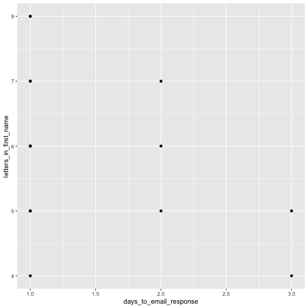
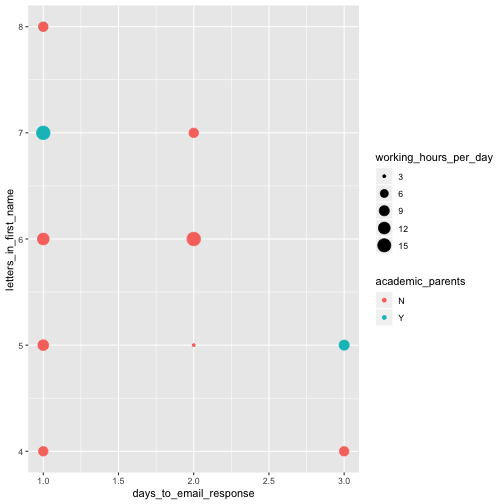
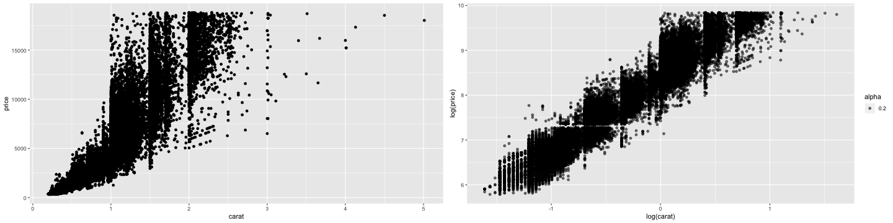
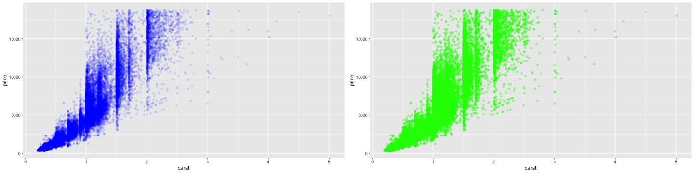
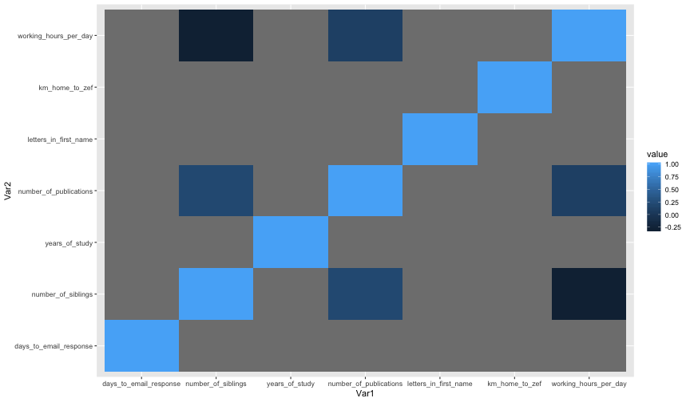

<style>
.section .reveal .state-background {
    background: white;}
.section .reveal h1,
.section .reveal p {
    color: black;
    position: relative;
    top: 4%;}
    </style>
    
Data Visualization
========================================================
author: Cory Whitney
font-family: 'Helvetica'
date: "2019-04-17"
width: 1920
height: 1080
css: mySlideTemplate.css
incremental: true


<div class="footer"></small>cory.whitney@uni-bonn.de </small></div>

Data visualization: getting stuck
========================================================
incremental: true
right: 30%

- **Open RStudio**


- **Help > Cheatsheets > Data Visualization with ggplot2**

- type ‘?’ in R console with function, package or data name
- Add “R” to a search with a copy of an error message
- Many talented programmers who scan the web and answer issues


</small>https://stackoverflow.com/ </small>

***

Hadley Wickham

Yihui Xie

<small>https://yihui.name/en/2017/08/so-gh-email/</small>

<small>https://rmarkdown.rstudio.com/ </small>

Creating basic plots
========================================================
incremental: true

**R has several systems for making graphs**

- **Base R** 


```r
participants_data <- read.csv("participants_data.csv")

plot(participants_data$academic_parents)
```


<small>Bar plot of number of observations of binary data related to academic parents </small>

***


```r
plot(participants_data$academic_parents, participants_data$days_to_email_response)
```


<small>Boxplot of days to email response grouped by binary data related to academic parents</small>

**Use help '?' for function**

```r
?plot
```

ggplot2: overview
========================================================
incremental: true
right: 80%

***

**Many libraries and functions for graphs in R...**

- **ggplot2** is one of the most elegant and most versatile.

- **ggplot** implements the *grammar of graphics* to describe and build graphs. 

- Do more and do it faster by learning one system and applying it in many places.

- Learn more about ggplot2 in “The Layered Grammar of Graphics”

<http://vita.had.co.nz/papers/layered-grammar.pdf>


ggplot2: qplot with participant data
========================================================
incremental: true
right: 80%


**qplot: 'poor man's ggplot?**
***


```r
library(ggplot2)

qplot(days_to_email_response, letters_in_first_name, data = participants_data)
```


<small>Scatterplot of days to email response as a function of the letters in your first name</small>

**Use help '?' for function**

```r
?qplot
```

<small>Want to understand how all the pieces fit together? See the R
for Data Science book: http://r4ds.had.co.nz/</small>

ggplot2: qplot with your data
========================================================
incremental: true
right: 80%


***

**Example from your data**


```r
qplot(days_to_email_response, letters_in_first_name, color=academic_parents, size=working_hours_per_day, data=participants_data)
```


<small>Scatterplot of letters in your first name as a function of days to email response with colors representing binary data related to academic parents and working hours per day as bubble sizes.</small>

**Make more graphs**

ggplot2: qplot with iris data
========================================================
incremental: true
right: 80%


***

**Example from Anderson's iris data set**


```r
qplot(Sepal.Length, Petal.Length, data=iris, color=Species, size=Petal.Width)
```


<small>Scatterplot of iris petal length as a function of sepal length with colors representing iris species and petal width as bubble sizes.</small>

**Use help '?' for data**

```r
?iris
```


ggplot2: qplot with diamonds price
========================================================
incremental: true
right: 80%


***

**qplot** accepts formula arguments such as log
```
qplot(carat, price, data = diamonds)
```
```
qplot(log(carat), log(price), data = diamonds)
```


**Use help '?' for data**

```r
?diamonds
```


ggplot2: qplot diamonds color shape
========================================================
incremental: true
right: 80%


***

```
#Create a sample

dsmall <- diamonds[sample(nrow(diamonds), 100), ]

#Plot with different colours for color
qplot(carat, price, data = dsmall, colour = color)

#Plot with different shapes for cut 
qplot(carat, price, data = dsmall, shape = cut)
```

~~Different colors and shapes~~

**Use help '?' for function**

```r
?sample
```

```
Help on topic 'sample' was found in the following packages:

  Package               Library
  dplyr                 /Users/macbook/Library/R/3.5/library
  base                  /Library/Frameworks/R.framework/Resources/library


Using the first match ...
```


ggplot2: qplot set parameters
========================================================
incremental: true
right: 80%


***

Set parameters manually with I()
```
qplot(carat, price, data = diamonds, alpha=I(0.1), colour=I("blue"))
```
```
qplot(carat, price, data = diamonds, alpha=I(0.4), colour=I("green"))
```


~~Inhibit Interpretation / Conversion of Objects~~

**Use help '?' for function**

```r
?I
```

ggplot2: geom
========================================================
incremental: true
right: 80%


***

With “geom” different types of plots can be defined e.g. points, line, boxplot, path, smooth. 
These can also be combined in a vector.
```
qplot(carat,price,data=dsmall, geom="line")
```
```
qplot(carat,price,data=dsmall, geom="smooth")
```
```
qplot(carat,price,data=dsmall, geom=c("point","smooth"))
```

~~ggplot2 geom options~~

**Use help '?' for function**

```r
?qplot
```
~~read 'Arguments' section of help file~~

ggplot2: smooth function
========================================================
incremental: true
right: 80%


***

Depending on your dataset size the smooth function will select different lines and smoothing methods.
```
qplot(carat,price,data=dsmall,geom=c("point","smooth"))
```
```
qplot(carat,price,data=diamonds,geom=c("point","smooth"))
```
With span the wiggliness of the line is controlled.
```
qplot(carat,price,data=dsmall, geom=c("point","smooth"), span=0.2)
```
Use method to specify your smoothing method
```
qplot(carat,price,data=dsmall,geom=c("point","smooth"),method="lm")
```


~~ggplot2 lines and smoothing options~~


ggplot2: Boxplots and jitter
========================================================
incremental: true
right: 80%


***

- Boxplots can be displayed through geom=“boxplot”. 

```
qplot(color,price/carat,data=diamonds,  geom="boxplot")
```

- Jittered plots (geom=“jitter”) show all points. In case of overplotting changing alpha can help.

```
qplot(color,price/carat,data=diamonds, geom="jitter")
```
```
qplot(color,price/carat,data=diamonds, geom="jitter", alpha=I(0.1))
```


~~ggplot2 boxplots and jitter~~

ggplot2: Histograms
========================================================
incremental: true
right: 80%


***

Histograms can be displayed through geom=“histogram”.
```
qplot(carat, data = diamonds, geom = "density")
```
```
qplot(carat, data = diamonds, geom = "density", colour = color)
```
```
qplot(carat, data = diamonds, geom = "density", fill = color, alpha=I(0.3))
```


~~ggplot2 histograms~~

ggplot2: subset
========================================================
incremental: true
right: 80%


***

Use factor to subset your data.
```
qplot(displ, hwy, data = mpg, colour = cyl, geom=c("point","smooth"),method="lm")
```
```
qplot(displ, hwy, data = mpg, colour = factor(cyl), geom=c("point","smooth"),method="lm")
```


~~ggplot2 subset with smooth line~~

ggplot2: "slow ggplotting"
========================================================
incremental: true
right: 80%


***

- pulling out aes() from the ggplot() function:  
- using fewer functions; example - using labs() to add a title instead of ggtitle()
- using functions multiple times; example aes(x = var1) + aes(y = var2) rather than aes(x = var1, y = var2)
- using base R functions and tidyverse functions.  For other packages, the :: style to call them
- write out arguments (no shortcuts)  aes(x = gdppercap) not aes(gdppercap)
- order ggplot commands so that reactivity is obvious; scale adjustments to aesthetics might also be near the aesthetic declaration.

~~<https://evamaerey.github.io/ggplot_flipbook/ggplot_flipbook_xaringan.html#1>~~

ggplot2: slow ggplotting example
========================================================
incremental: true
right: 80%


***
Usual ggplot code
```
ggplot(mtcars, aes(mpg, y = hp, col = gear)) +
  geom_point() +
  ggtitle("My Title") +
  labs(x = "the x label", y = "the y label", col = "legend title")
```
'Slow ggplotting' version for same plot
``` 
  ggplot(data = mtcars) +
  aes(x = mpg) +
  labs(x = "the x label") +
  aes(y = hp) +
  labs(y = "the y label") +
  geom_point() +
  aes(col = gear) +
  labs(col = "legend title") +
  labs(title = "My Title")
```


~~<https://evamaerey.github.io/ggplot_flipbook/ggplot_flipbook_xaringan.html#1>~~

Correlation
========================================================
incremental: true
right: 80%


***


```r
cor.test(participants_data$days_to_email_response, participants_data$letters_in_first_name)
```

```

	Pearson's product-moment correlation

data:  participants_data$days_to_email_response and participants_data$letters_in_first_name
t = -1.647, df = 13, p-value = 0.1235
alternative hypothesis: true correlation is not equal to 0
95 percent confidence interval:
 -0.7649469  0.1229287
sample estimates:
       cor 
-0.4154989 
```

**Use help '?' for function**

```r
?cor.test
```

Bonus: gganimate Datasaurus Dozen
========================================================
incremental: true


- Using the datasauRus, ggplot2 and gganimate libraries.
- Note the many calls for ggplot

```
ggplot(datasaurus_dozen, aes(x=x, y=y))+
  geom_point()+
  theme_minimal() +
  transition_states(dataset, 3, 1) + 
  ease_aes('cubic-in-out')
```

***


  
Bonus: gganimate mtcars mpg
========================================================
incremental: true


- Using the gifski, ggplot2 and gganimate libraries.

```
ggplot(mtcars, aes(factor(cyl), mpg)) + 
  geom_boxplot() + 
  geom_point() +
  transition_states(am, transition_length = 4, state_length = 1) + 
  view_follow()
```

***


ggplot2: geom_tile
========================================================
incremental: true


- Using the dplyr, ggplot2 and reshape2 libraries.

```
part_data<-select(participants_data, days_to_email_response, number_of_siblings, years_of_study, number_of_publications, letters_in_first_name, km_home_to_zef, working_hours_per_day, days_to_email_response)
```
```
cormat <- round(cor(part_data), 1)
melted_cormat <- melt(cormat)
```
```
ggplot(data = melted_cormat, aes(x=Var1, 
y=Var2, fill=value)) + 
geom_tile()
```

***



- Check with journal about size, resolution etc.


```r
?pdf
```


```r
?png
```

Export Figures
========================================================
incremental: true
right: 70%


***

```
png(file = "cortile.png", width = 7, height = 6, units = "in", res = 300)

ggplot(data = melted_cormat, aes(x = Var1, y = Var2, fill = value)) + geom_tile() + theme(axis.text.x = element_text(angle = 45, hjust = 1))

dev.off()
```
```
list.files()
```
~~If time create and export more figures~~

Tasks for the afternoon: Basic
========================================================
incremental: true
right: 80%


***

- Check your data for interesting trends and correlations
- Use scatter plots, barcharts and boxplots
- Bootstrap and vary the sample and run the same analysis and plots
- Save your most interesting figure and share it with us tomorrow

Tasks for the afternoon: Advanced
========================================================
incremental: true
right: 80%


***

- Import data from an external source (e.g. FAO, World Bank)
- Display those data in an interactive plot
- Play around with the design
- Export your most interesting figure and share it with us tomorrow

Be prepared for tomorrow
========================================================
incremental: true

Install Git & join Github (if you have not already). 

Git
<small>https://git-scm.com/downloads</small>

join Github
<small>https://github.com/</small>

*** 


