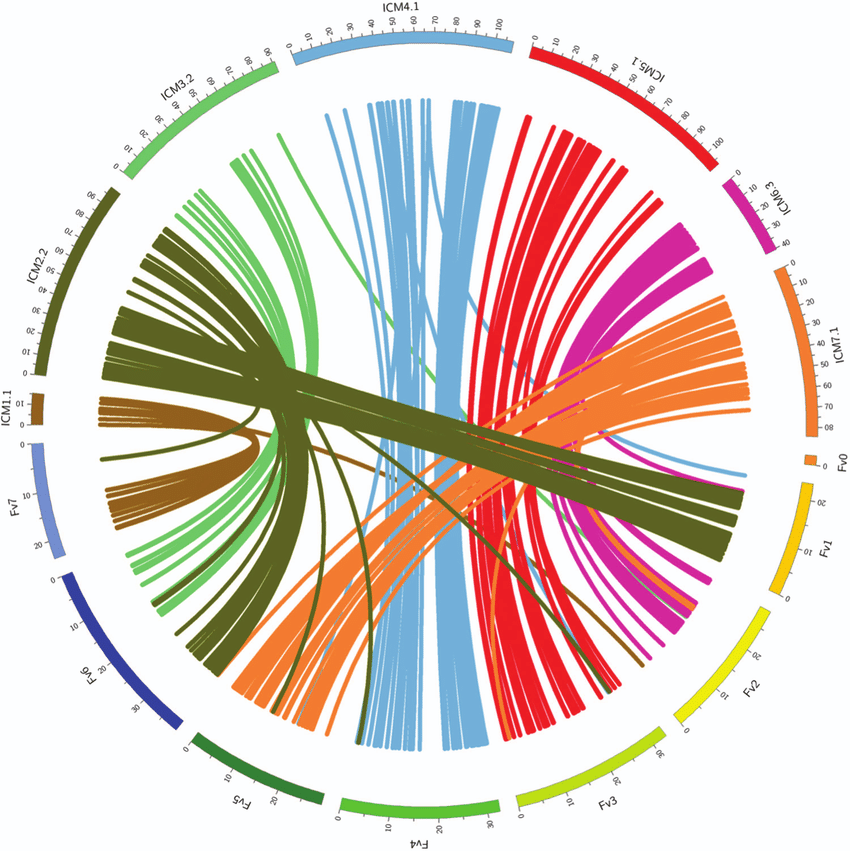
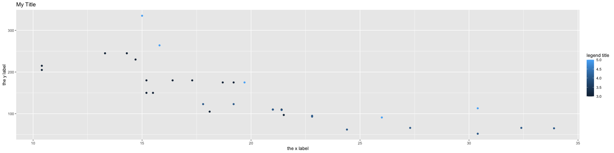
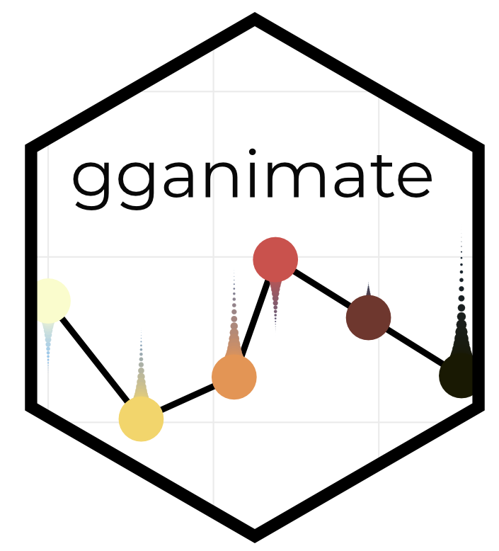

<style>
.section .reveal .state-background {
    background: white;}
.section .reveal h1,
.section .reveal p {
    color: black;
    position: relative;
    top: 4%;}
    </style>
    
<!-- enable caching globally for the presentation with this code chunk: If you run into problems with cached output you can always use the Clear Knitr Cache command on the More menu to rebuild your presentation without previously cached output. -->
    


Data Visualization
========================================================
author: Cory Whitney
font-family: 'Helvetica'
autosize: true
css: mySlideTemplate.css
incremental: true



<div class="footer"></small>cory.whitney@uni-bonn.de </small></div>

Data visualization: getting stuck
========================================================
incremental: true

- **Open RStudio**


- type ‘?’ in R console with function, package or data name
- Add “R” to a search with a copy of an error message

- **Help > Cheatsheets > Data Visualization with ggplot2**

Data visualization: getting help
========================================================
incremental: true
right: 30%


- Many talented programmers 
- Some scan the web and answer issues


</small>https://stackoverflow.com/ </small>

***


Hadley Wickham

Yihui Xie

<small>https://yihui.name/en/2017/08/so-gh-email/</small>

<small>https://rmarkdown.rstudio.com/ </small>

Getting your data in R
========================================================
incremental: true
<small>Load data</small> 

- Load the data

```r
participants_data <- read.csv("participants_data.csv")
```
- Keep your data in the same folder structure as .RProj
- at or below the level of .RProj

Creating a barplot in base R
========================================================
incremental: true

**R has several systems for making graphs**

- **Base R** 
- Create a barplot with the `plot()` function


```r
plot(participants_data$academic_parents)
```


<small>Bar plot of number of observations of binary data related to academic parents</small>

Creating a boxplot in base R
========================================================
incremental: true

- Create a boxplot with the same `plot()` function


```r
plot(participants_data$academic_parents, participants_data$days_to_email_response)
```


<small>Boxplot of days to email response grouped by binary data related to academic parents</small>

ggplot2: overview
========================================================
incremental: true
right: 80%


***

**Many libraries and functions for graphs in R...**

- **ggplot2** is one of the most elegant and most versatile.

- **ggplot** implements the *grammar of graphics* to describe and build graphs. 

- Do more and do it faster by learning one system and applying it in many places.

- Learn more about ggplot2 in “The Layered Grammar of Graphics”

<http://vita.had.co.nz/papers/layered-grammar.pdf>


ggplot2: names and email
========================================================
incremental: true
right: 80%


***

**Example from your data**


```r
library(ggplot2)
ggplot(data = participants_data, aes(x=letters_in_first_name, y=days_to_email_response)) + 
  geom_point()
```


<small>Scatterplot of days to email response as a function of the letters in your first name</small>

<small>Want to understand how all the pieces fit together? See the R
for Data Science book: http://r4ds.had.co.nz/</small>

ggplot2: add color and size
========================================================
incremental: true
right: 80%


***


```r
ggplot(data = participants_data, aes(x=letters_in_first_name, y=days_to_email_response, color=academic_parents, size=working_hours_per_day)) + 
  geom_point()
```


<small>Scatterplot of letters in your first name as a function of days to email response with colors representing binary data related to academic parents and working hours per day as bubble sizes.</small>

**Make more graphs**

ggplot2: iris data
========================================================
incremental: true
right: 80%


***

**Example from Anderson's iris data set**


```r
ggplot(data=iris, aes(x=Sepal.Length, y=Petal.Length, color=Species, size=Petal.Width))+ 
  geom_point()
```


<small>Scatterplot of iris petal length as a function of sepal length with colors representing iris species and petal width as bubble sizes.</small>

ggplot2: diamonds price
========================================================
incremental: true
right: 80%


***

**ggplot** accepts formula arguments such as log
```
ggplot(data = diamonds, aes(x=carat, y=price, alpha = 0.2)) + geom_point()
```
```
ggplot(data = diamonds, aes(x=log(carat), y= log(price), alpha = 0.2)) + geom_point()
```


ggplot2: diamonds color shape
========================================================
incremental: true
right: 80%


***


```r
library(dplyr)
dsmall <- top_n(diamonds, n=100)
#Plot with different colors for color
ggplot(data = dsmall, aes(x=carat, y=price, color = color))+ geom_point()
```

```r
#Plot with different shapes for cut 
ggplot( data = dsmall, aes(carat, price, shape = cut)) + geom_point()
```


ggplot2: set parameters
========================================================
incremental: true
right: 80%


***

Set parameters manually with `I()` *Inhibit Interpretation / Conversion of Objects*

```r
ggplot(data = diamonds, aes(carat, price, alpha=I(0.1), color=I("blue"))) + geom_point()
```

```r
ggplot(data = diamonds, aes(carat, price, alpha=I(0.4), color=I("green"))) + geom_point()
```


ggplot2: geom options
========================================================
incremental: true
right: 80%


***

With “geom” different types of plots can be defined e.g. points, line, boxplot, path, smooth. These can also be combined.
```
ggplot(data=dsmall, aes(x=carat, y=price))+
geom_point()+
geom_smooth()
```


ggplot2: smooth function
========================================================
incremental: true
right: 80%


***

`geom_smooth()` selects a smoothing method based on the data. Use `method =` to specify your preferred smoothing method.
```
ggplot(data=dsmall, aes(x=carat, y=price))+ geom_point()+ geom_smooth()

ggplot(data=diamonds, aes(x=carat, y=price))+ geom_point()+ 
geom_smooth(method = 'glm')
```


~~ggplot2 lines and smoothing options~~


ggplot2: boxplots 
========================================================
incremental: true
right: 80%


***

- Boxplots can be displayed through `geom_boxplot()`. 


```r
ggplot(data=diamonds, aes(x=color, y=price/carat)) + 
geom_boxplot()
```


ggplot2: jitter points 
========================================================
incremental: true
right: 80%


***

- Jittered plots `geom_jitter()` show all points. 


```r
ggplot(data=diamonds, aes(x=color, y=price/carat)) + 
geom_boxplot()+ 
geom_jitter()
```


ggplot2: adding alpha 
========================================================
incremental: true
right: 80%


***

In case of overplotting changing `alpha` can help.

```r
ggplot(data=diamonds, aes(x=color, y=price/carat, alpha=I(0.1))) + 
geom_boxplot()+ 
geom_jitter()
```


ggplot2: geom_histogram
========================================================
incremental: true
right: 80%


***

```
ggplot(data = diamonds, aes(x=carat)) +
geom_density()

ggplot(data = diamonds, aes(x=carat, color = color)) +
geom_density()

ggplot(data = diamonds, aes(x=carat, color = color, alpha=I(0.3))) +
geom_density()
```


~~ggplot2 histograms~~

ggplot2: subset
========================================================
incremental: true
right: 80%


***

Use factor to subset your data.
```
ggplot(data = mpg, aes(x=displ, y=hwy,  color = cyl))+ 
geom_point()+
geom_smooth(method="lm")

ggplot(data = mpg, aes(x=displ, y=hwy,  color = factor(cyl)))+ 
geom_point()+
geom_smooth(method="lm")
```


~~ggplot2 subset with smooth line~~

ggplot2: "slow ggplotting"
========================================================
incremental: true
right: 80%


for `aes()` in `ggplot()`
***

- using fewer functions; example - using labs() to add a title instead of ggtitle()
- using functions multiple times; example aes(x = var1) + aes(y = var2) rather than aes(x = var1, y = var2)
- using base R functions and tidyverse functions.  For other packages, the :: style to call them
- write out arguments (no shortcuts)  aes(x = gdppercap) not aes(gdppercap)

<small><https://evamaerey.github.io/ggplot_flipbook/ggplot_flipbook_xaringan.html#1></small>

ggplot2: not slow example
========================================================
incremental: true
right: 80%


***
ggplot code in non-slow fashion

```r
ggplot(mtcars, aes(mpg, y = hp, col = gear)) +
  geom_point() +
  ggtitle("My Title") +
  labs(x = "the x label", y = "the y label", col = "legend title")
```



ggplot2: slow ggplotting example
========================================================
incremental: true
right: 80%


***
'Slow ggplotting' version for the same plot

```r
  ggplot(data = mtcars) +
  aes(x = mpg) +
  labs(x = "the x label") +
  aes(y = hp) +
  labs(y = "the y label") +
  geom_point() +
  aes(col = gear) +
  labs(col = "legend title") +
  labs(title = "My Title")
```


<small><https://evamaerey.github.io/ggplot_flipbook/ggplot_flipbook_xaringan.html#1></small>

ggplot2: geom_tile
========================================================
incremental: true
right: 80%


***

- Use `dplyr`, `ggplot2` and `reshape2` 

```
part_data<-select_if(participants_data, is.numeric)

cormat <- round(cor(part_data), 1)
melted_cormat <- melt(cormat)

ggplot(data = melted_cormat, aes(x=Var1, 
y=Var2, fill=value)) + 
geom_tile()
```


Export Figures
========================================================
incremental: true
right: 70%


***

```
png(file = "cortile.png", width = 7, height = 6, units = "in", res = 300)

ggplot(data = melted_cormat, aes(x = Var1, y = Var2, fill = value)) + geom_tile() + theme(axis.text.x = element_text(angle = 45, hjust = 1))

dev.off()
```

- Check with journal about size, resolution etc.


```r
?pdf
```


gganimate: datasauRus
========================================================
incremental: true
right: 80%


***

- Use `datasauRus`, `ggplot2` and `gganimate` 

```
library(gganimate)
library(datasauRus)
```
```
ggplot(datasaurus_dozen, aes(x=x, y=y))+
  geom_point()+
  theme_minimal() +
  transition_states(dataset, 3, 1) + 
  ease_aes('cubic-in-out')
```

gganimate: Datasaurus Dozen
========================================================
incremental: true
right: 80%


***


  
gganimate: diamonds carat
========================================================
incremental: true
right: 80%


***

- Use `tidyverse`, `ggplot2` and `gganimate`


```r
ggplot(data = dsmall, aes(x = carat, y = price, color = color)) + 
  geom_line() +
  transition_reveal(carat) + 
  ease_aes("linear") +
  labs(title='Diamond carat: {frame_along}')
```


Tasks for the afternoon: Basic
========================================================
incremental: true
right: 80%


***

**Test your new skills**

- Use scatter plots, barcharts and boxplots
- Vary the sample and run the same analysis and plots
- Save your most interesting figure and share it with us tomorrow

Tasks for the afternoon: Advanced
========================================================
incremental: true
right: 80%


***

**Your turn to perform**

- Import data from an external source (e.g. FAO, World Bank)
- Display those data in an interactive plot
- Play around with the design
- Export your most interesting figure and share it with us
