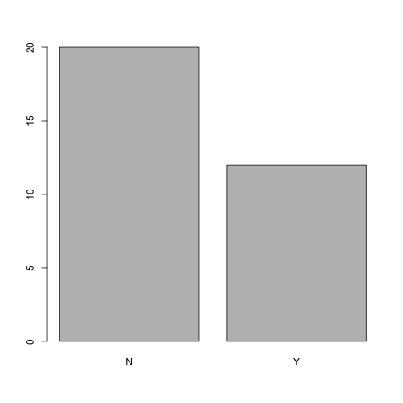
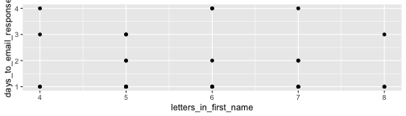

<style>
.section .reveal .state-background {
    background: white;}
.section .reveal h1,
.section .reveal p {
    color: black;
    position: relative;
    top: 4%;}
    </style>
    
<!-- enable caching globally for the presentation with this code chunk: If you run into problems with cached output you can always use the Clear Knitr Cache command on the More menu to rebuild your presentation without previously cached output. -->
    


Data Visualization
========================================================
author: Cory Whitney
font-family: 'Helvetica'
autosize: true
css: mySlideTemplate.css
incremental: true


<div class="footer"></small>cory.whitney@uni-bonn.de </small></div>

Data visualization: getting stuck
========================================================
incremental: true

- **Open RStudio**

- type `?` in R console with function, package or data name
- Add `R` to a search with a copy of an error message

- **Help > Cheatsheets > Data Visualization with ggplot2**

Data visualization: getting help
========================================================
incremental: true
right: 30%


- Many talented programmers 
- Some scan the web and answer issues


</small>https://stackoverflow.com/ </small>

***


Hadley Wickham


Yihui Xie
<small>https://yihui.name/en/2017/08/so-gh-email/</small>

Getting your data in R
========================================================
incremental: true
<small>Load data</small> 

- Load the data

```r
participants_data <- read.csv("participants_data.csv")
```
- Keep your data in the same folder structure as .RProj
- at or below the level of .RProj

Creating a barplot in base R
========================================================
incremental: true

**R has several systems for making graphs**

- **Base R** 
- Create a barplot with the `table()` and `barplot()` functions


```r
participants_barplot <- table(participants_data$academic_parents)

barplot(participants_barplot)
```


<small>Bar plot of number of observations of binary data related to academic parents</small>

ggplot2: 'Grammar of Graphics' Overview
========================================================
incremental: true
right: 80%


***

**Many libraries and functions for graphs in R...**

- **ggplot2** is one of the most elegant and most versatile.

- **ggplot** implements the *grammar of graphics* to describe and build graphs. 

- Do more and do it faster by learning one system and applying it in many places.

- Learn more about ggplot2 in “The Layered Grammar of Graphics”

<http://vita.had.co.nz/papers/layered-grammar.pdf>


ggplot2: names and email
========================================================
incremental: true
right: 80%


***

**Example from your data**


```r
library(ggplot2)
ggplot(data = participants_data, 
       aes(x = letters_in_first_name, 
           y = days_to_email_response)) + 
  geom_point()
```


<small>Scatterplot of days to email response as a function of the letters in your first name</small>

<small>Want to understand how all the pieces fit together? See the R
for Data Science book: http://r4ds.had.co.nz/</small>

ggplot2: add color and size
========================================================
incremental: true
right: 80%


***


```r
ggplot(data = participants_data, 
       aes(x = letters_in_first_name, 
           y = days_to_email_response, 
           color = academic_parents, 
           size = working_hours_per_day)) + 
  geom_point()
```


<small>Scatterplot of letters in your first name as a function of days to email response with colors representing binary data related to academic parents and working hours per day as bubble sizes.</small>

**Make more graphs**

ggplot2: iris data
========================================================
incremental: true
right: 80%


***

**Example from Anderson's iris data set**


```r
ggplot(data = iris, 
       aes(x = Sepal.Length, 
           y = Petal.Length, 
           color = Species, 
           size = Petal.Width))+ 
  geom_point()
```


<small>Scatterplot of iris petal length as a function of sepal length with colors representing iris species and petal width as bubble sizes.</small>

ggplot2: diamonds price
========================================================
incremental: true
right: 80%


***

**ggplot** accepts formula arguments such as log


```r
ggplot(data = diamonds,
       aes(x = log(carat),
           y = log(price),
           alpha = 0.2)) + 
  geom_point()
```


ggplot2: diamonds color shape
========================================================
incremental: true
right: 80%


***


ggplot2: set parameters
========================================================
incremental: true
right: 80%


***

Set parameters manually with `I()` *Inhibit Interpretation / Conversion of Objects*


ggplot2: geom options
========================================================
incremental: true
right: 80%


***

With “geom” different types of plots can be defined e.g. points, line, boxplot, path, smooth. These can also be combined.


ggplot2: smooth function
========================================================
incremental: true
right: 80%


***

`geom_smooth()` selects a smoothing method based on the data. Use `method =` to specify your preferred smoothing method.


~~ggplot2 lines and smoothing options~~


ggplot2: boxplots 
========================================================
incremental: true
right: 80%


***

- Boxplots can be displayed through `geom_boxplot()`. 


```r
# Create a boxplot where the x-axis is cut and
#  the y-axis is price divided by carat
ggplot(data = diamonds, 
       aes(x = cut, 
           y = price/carat)) + 
geom_boxplot()
```


ggplot2: jitter points 
========================================================
incremental: true
right: 80%


***

- Jittered plots `geom_jitter()` show all points. 


```r
# Create a jittered boxplot where the x-axis is cut and
#  the y-axis is price divided by carat
ggplot(data = diamonds, 
       aes(x = color, 
           y = price/carat)) + 
geom_boxplot()+ 
geom_jitter()
```


<!-- "many more examples in the tutorial" -->

Your turn to perform
========================================================
incremental: true
right: 80%


***

After you have gone through the tutorial please do the following exercises.

- Create a scatter plot, barchart and boxplot (as above)
- Vary the sample and run the same analysis and plots
- Save your most interesting figure and share it with us
