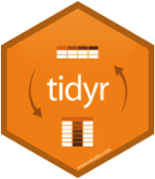

<style>
.section .reveal .state-background {
    background: white;}
.section .reveal h1,
.section .reveal p {
    color: black;
    position: relative;
    top: 4%;}
    </style>
    
<style>

.footer {
    color: black; background: white;
    position: fixed; top: 100%;
    text-align:left; width:100%;
}

</style>

Data Wrangling
========================================================
author: Cory Whitney
font-family: 'Helvetica'
date: "2019-03-19"
width: 1920
height: 1080
css: mySlideTemplate.css


<div class="footer"></small>cory.whitney@uni-bonn.de </small></div>

Overview
====================================
incremental: true
right: 70%



***
- Notes on R
- Tidy code style using tidyR 
- Clean and intuitive functions using dplyr
- Concise code using magrittr 'Ceci n'est pas une pipe'


Notes on R: About process
========================================================
incremental: true

- "[...] writing R code is a hedonistically artistic, left-brained, paint-in-your-hair sort of experience [...] 
- learn how to code the same way we learned how to catch salamanders as children – trial and error, flipping over rocks till we get a reward [...] 
- once the ecstasy of creation has swept over us, we awake late the next morning to find our canvas covered with 2100 lines of R code [...] 
- Heads throbbing with a statistical absinthe hangover, we trudge through it slowly over days, trying to figure out what we did."

Andrew MacDonald <small>@polesasunder </small>

<div class="footer" style="margin-top;font-size:60%;"> 
thestudyofthehousehold.com </div>


Notes on R: Focus
========================================================
incremental: true
right: 90%
***


Notes on R: Keeping track of work
========================================================
incremental: true
right: 80%


Keep it tidy
***

Use ‘#’ to annotate and not run

If not Rmarkdown then at least use ‘----’ or ‘####’ 

#Section 1----

#Section 2####

#Section 3####

<span style="font-weight:bold; color:red;">TOC in upper right console</span>


<div class="footer" style="margin-top;font-size:60%;"> 
http://style.tidyverse.org/ </div>

Notes on R: tidy tools manifesto
========================================================
incremental: true
right: 80%


Keep it tidy
***


```r
# The easiest way to get libraries for today is to install the whole tidyverse:
#install.packages("tidyverse")
library(tidyverse)
browseVignettes(package = "tidyverse")
```

The tidy tools manifesto

<!--    -->
<!-- Hadley Wickham -->
<div class="footer"></small>http://style.tidyverse.org/ </small></div>

Notes on R: tidyR process
========================================================
incremental: true
right: 80%


Keep it tidy
***


- Good coding style is like correct punctuation:
- withoutitthingsarehardtoread

<div class="footer" style="margin-top;font-size:60%;"> 
http://style.tidyverse.org/ </div>

Notes on R: Keep your data tidy
========================================================
incremental: true
right: 80%


Keep it tidy
***

- Keep your data tidy
- When your data is tidy, each column is a variable, and each row is an observation
- Consistent structure lets you focus your struggle on questions about the data, not fighting to get the data into the right form for different functions


<div class="footer" style="margin-top;font-size:60%;"> 
http://style.tidyverse.org/ </div>

Notes on R: Tidy Data
========================================================
incremental: true

H. Wickham, Tidy Data, Journal of Statistical Software, 59(10)

Three things make a dataset tidy:
- Each variable with its own column.
- Each observation with its own row.
- Each value with its own cell.


<div class="footer" style="margin-top;font-size:60%;"> 
http://www.jstatsoft.org/v59/i10/paper </div>


Wrangling: transform
========================================================
incremental: true

- Once you have __tidy__ data, a common first step is to __transform__ it
- narrowing in on observations of interest
- creating new variables that are functions of existing variables
- calculating a set of summary statistics

 
<div class="footer"></small><small>http://www.codeastar.com/data-wrangling/</small> </small></div>

Wrangling: dplyr arguments
========================================================
incremental: true
<small>Format of __dplyr__</small>  


***
- __Arguments start with a data frame__
- __select__: return a subset of the columns
- __filter__: extract a subset of rows
- __arrange__: reorder rows
- __rename__: rename variables
- __mutate__: add new variables and columns or transform
- __summarize__: generate tables of summary statistics

<div class="footer" style="margin-top;font-size:60%;"> 
https://dplyr.tidyverse.org/ </div>

Wrangling: dplyr library
========================================================
incremental: true
left: 70%
<small>Using __dplyr__</small>  


```r
library(dplyr)
```


 <small>genomicsclass.github.io/book/pages/dplyr_tutorial</small>

***


<small>Roger Peng</small>


<div class="footer" style="margin-top;font-size:60%;"> 
https://dplyr.tidyverse.org/ </div>


Wrangling: dplyr::select
========================================================
incremental: true
<small>Subsetting</small> 

__Select__


```r
aca_work_filter<-select(participants_data, academic_parents, working_hours_per_day)
```

```
  academic_parents working_hours_per_day
1                N                     8
2                Y                     8
3                N                     7
4                Y                    16
5                N                    12
6                N                    16
```

```r
non_aca_work_filter<-select(participants_data, -academic_parents, -working_hours_per_day)
```

```
  batch age gender continent_of_origin research_continent
1  2017  33      F              Europe             Europe
2  2017  31      F       South America      South America
3  2017  30      F       South America      South America
4  2017  28      M              Africa             Africa
5  2017  30      M              Africa             Africa
6  2017  30      M              Africa             Africa
  number_of_publications number_of_siblings km_home_to_zef years_of_study
1                      6                  1            1.7             20
2                      0                  2           40.0              9
3                      1                  2        10370.0              7
4                      1                  1           15.0              3
5                      3                  5            6.0              7
6                      3                  4            8.3             10
  days_to_email_response letters_in_first_name
1                      1                     4
2                      1                     6
3                      1                     7
4                      1                     7
5                      1                     6
6                      2                     6
```
<div class="footer" style="margin-top;font-size:60%;"> 
https://dplyr.tidyverse.org/ </div>


Wrangling: dplyr::filter
========================================================
incremental: true
<small>Subsetting</small> 


__Filter__

```r
work_filter<-filter(participants_data, working_hours_per_day >10)
```

```r
work_name_filter<-filter(participants_data, working_hours_per_day >10 & letters_in_first_name >6)
work_name_filter
```

```
  batch age gender continent_of_origin research_continent
1  2017  28      M              Africa             Africa
  number_of_publications working_hours_per_day number_of_siblings
1                      1                    16                  1
  academic_parents km_home_to_zef years_of_study days_to_email_response
1                Y             15              3                      1
  letters_in_first_name
1                     7
```

<div class="footer" style="margin-top;font-size:60%;"> 
https://dplyr.tidyverse.org/ </div>


Wrangling: dplyr::rename
========================================================
incremental: true
<small> __Rename__ </small> 


```r
participants_data <- rename(participants_data, name_length = letters_in_first_name)
```

```r
participants_data <- rename(participants_data,
daily_labor = working_hours_per_day)
names(participants_data)
```

```
 [1] "batch"                  "age"                   
 [3] "gender"                 "continent_of_origin"   
 [5] "research_continent"     "number_of_publications"
 [7] "daily_labor"            "number_of_siblings"    
 [9] "academic_parents"       "km_home_to_zef"        
[11] "years_of_study"         "days_to_email_response"
[13] "name_length"           
```
<div class="footer" style="margin-top;font-size:60%;"> 
https://dplyr.tidyverse.org/ </div>


Wrangling: dplyr::mutate
========================================================
incremental: true
<small> __Mutate__ </small> 


```r
participants_data <- mutate(participants_data, labor_mean = daily_labor*mean(daily_labor, na.rm=T))
# head(participants_data)
```


```r
participants_data <- mutate(participants_data, neg_sib_mean = number_of_siblings -mean(number_of_siblings))
head(participants_data)
```

```
  batch age gender continent_of_origin research_continent
1  2017  33      F              Europe             Europe
2  2017  31      F       South America      South America
3  2017  30      F       South America      South America
4  2017  28      M              Africa             Africa
5  2017  30      M              Africa             Africa
6  2017  30      M              Africa             Africa
  number_of_publications daily_labor number_of_siblings academic_parents
1                      6           8                  1                N
2                      0           8                  2                Y
3                      1           7                  2                N
4                      1          16                  1                Y
5                      3          12                  5                N
6                      3          16                  4                N
  km_home_to_zef years_of_study days_to_email_response name_length
1            1.7             20                      1           4
2           40.0              9                      1           6
3        10370.0              7                      1           7
4           15.0              3                      1           7
5            6.0              7                      1           6
6            8.3             10                      2           6
  labor_mean neg_sib_mean
1    70.5000       -2.375
2    70.5000       -1.375
3    61.6875       -1.375
4   141.0000       -2.375
5   105.7500        1.625
6   141.0000        0.625
```
<div class="footer"></small><small>https://dplyr.tidyverse.org/ </small> </small></div>

Wrangling: dplyr::group_by
========================================================
incremental: true
<small> __Group by__ </small>  create a commute category


```r
participants_data <- mutate(participants_data, commute = factor(1* (km_home_to_zef > 10), labels = c("commuter", "local")), na.rm=T)
```
<!-- #remove missing data -->
<!-- #new_participants_data <- participants_data[1:15,] -->

```r
new_participants_data <- drop_na(participants_data)
commuter_data <- group_by(new_participants_data, commute)
commuter_data
```

```
# A tibble: 15 x 17
# Groups:   commute [2]
   batch   age gender continent_of_or… research_contin… number_of_publi…
 * <int> <int> <fct>  <fct>            <fct>                       <int>
 1  2017    33 F      Europe           Europe                          6
 2  2017    31 F      South America    South America                   0
 3  2017    30 F      South America    South America                   1
 4  2017    28 M      Africa           Africa                          1
 5  2017    30 M      Africa           Africa                          3
 6  2017    30 M      Africa           Africa                          3
 7  2017    33 F      Africa           Africa                          0
 8  2017    30 F      South America    South America                   2
 9  2017    27 M      Europe           Europe                          0
10  2018    32 F      China            China                           2
11  2018    32 F      Asia             Asia                            2
12  2018    36 M      Africa           Africa                         10
13  2018    43 F      North America    North America                   2
14  2018    32 M      Asia             Asia                            2
15  2018    28 M      Asia             Asia                            0
# … with 11 more variables: daily_labor <int>, number_of_siblings <int>,
#   academic_parents <fct>, km_home_to_zef <dbl>, years_of_study <int>,
#   days_to_email_response <int>, name_length <int>, labor_mean <dbl>,
#   neg_sib_mean <dbl>, commute <fct>, na.rm <lgl>
```
<div class="footer" style="margin-top;font-size:60%;"> 
https://dplyr.tidyverse.org/ </div>


Wrangling: dplyr::summarize
========================================================
incremental: true
<small> __Summarize__ </small>  <small>get a summary of travel times and days to response</small>


```r
commuter_summary <- summarize(commuter_data, mean(days_to_email_response), median(name_length))
commuter_summary
```

```
# A tibble: 2 x 3
  commute  `mean(days_to_email_response)` `median(name_length)`
  <fct>                             <dbl>                 <dbl>
1 commuter                           1.55                     5
2 local                              1.25                     7
```


</small> <div class="footer"></small><small>https://dplyr.tidyverse.org/ </small> </small></div>

Wrangling: magrittr
========================================================
incremental: true
<small> __Pipeline %>%__ </small> 
- Do all the previous with a pipeline %>%

```r
pipe_data <- participants_data %>% 
  mutate(commute = factor(1* (km_home_to_zef > 10), 
                          labels = c("commuter", "local"))) %>% 
  drop_na() %>% 
  group_by(commute) %>% 
  summarize(mean(days_to_email_response), median(name_length), 
            max(years_of_study)) %>% 
  as.data.frame

pipe_data
```

```
   commute mean(days_to_email_response) median(name_length)
1 commuter                     1.545455                   5
2    local                     1.250000                   7
  max(years_of_study)
1                  20
2                   9
```

- Make your own query with `dplyr` and `magrittr`

purrr: Apply a function to each element of a vector
========================================================
incremental: true


```r
library(purrr)
```

purr Cheatsheet

purrr: Use
========================================================


Use purrr to solve: split a data frame into pieces, fit a model to each piece, compute the summary, then extract the R^2.


```r
library(purrr)

purrr_regression <- mtcars %>%
  split(.$cyl) %>% # from base R
  map(~ lm(mpg ~ wt, data = .)) %>%
  map(summary) %>%
  map_dbl("r.squared")

purrr_regression
```

```
        4         6         8 
0.5086326 0.4645102 0.4229655 
```

https://purrr.tidyverse.org/

If there is time

http://varianceexplained.org/r/teach-tidyverse/

Tasks for the afternoon: Basic
========================================================
incremental: true


***
- Create a dataset with a number of different variables of the course participants
- Data transformation (subsetting with base R and dplyr)
- Use magrittr pipeline to perform series of tasks with dplyr verbs
- Merge datasets in base R and dplyr
- Descriptive statistics (checks in base R and dplyr)

<div class="footer" style="margin-top;font-size:60%;"> 
cory.whitney@uni-bonn.de </div>


Tasks for the afternoon: Advanced
========================================================
incremental: true


***
- Use other R data set (e.g. iris, diamonds, ethnobotanydata) to work through  tasks 
  - long format in base
  - short format with magrittr pipeline
  - Descriptive statistics (checks in base R and dplyr)

<div class="footer" style="margin-top;font-size:60%;"> 
cory.whitney@uni-bonn.de </div>

