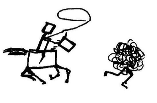

<style>
.section .reveal .state-background {
    background: white;}
.section .reveal h1,
.section .reveal p {
    color: black;
    position: relative;
    top: 4%;}
    </style>

Data Wrangling
========================================================
author: Cory Whitney
font-family: 'Helvetica'
date: "2019-03-12"
autosize: true
css: mySlideTemplate.css



<div class="footer"></small>cory.whitney@uni-bonn.de </small></div>

Overview
====================================
incremental: true
right: 70%


***
- Notes on R
- Tidy code style using tidyR 
- Clean and intuitive functions using dplyr
- Concise code using magrittr 'Ceci n'est pas une pipe'


Notes on R: About process
========================================================
incremental: true

"[...] writing R code is a hedonistically artistic, left-brained, paint-in-your-hair sort of experience [...] learn how to code the same way we learned how to catch salamanders as children – trial and error, flipping over rocks till we get a reward [...] once the ecstasy of creation has swept over us, we awake late the next morning to find our canvas covered with 2100 lines of R code [...] Heads throbbing with a statistical absinthe hangover, we trudge through it slowly over days, trying to figure out what we did."

Andrew MacDonald @polesasunder 
<div class="footer"></small>thestudyofthehousehold.com </small></div>

Notes on R: Concentration
========================================================


Notes on R: Keeping track of work
========================================================
incremental: true
<small>Keep it tidy</small>  

Use ‘#’ to annotate and not run

If not Rmarkdown then at least use ‘----’ or ‘####’ 

#Section 1----

#Section 2####

#Section 3####

<span style="font-weight:bold; color:red;">TOC in upper right console</span>

<div class="footer"></small>http://style.tidyverse.org/ </small></div>

Notes on R: tidy tools manifesto
========================================================
incremental: true
left: 70%
<small>Keep it tidy</small>  


```r
browseVignettes(package = "tidyverse")
```

The tidy tools manifesto

***
  
Hadley Wickham
<div class="footer"></small>http://style.tidyverse.org/ </small></div>

Notes on R: tidyR process
========================================================
incremental: true
<small>Keep it tidy</small>  


Good coding style is like correct punctuation:
withoutitthingsarehardtoread
<div class="footer"></small>http://style.tidyverse.org/ </small></div>

Notes on R: Keep your data tidy
========================================================
incremental: true
<small>Keep it tidy</small> 

- Keep your data tidy
- When your data is tidy, each column is a variable, and each row is an observation
- Consistent structure lets you focus your struggle on questions about the data, not fighting to get the data into the right form for different functions


<div class="footer"></small>http://style.tidyverse.org/ </small></div>

Notes on R: Tidy Data
========================================================
incremental: true

H. Wickham, Tidy Data, Journal of Statistical Software, 59(10)

Three things make a dataset tidy:
- Each variable with its own column.
- Each observation with its own row.
- Each value with its own cell.


<div class="footer"></small>http://www.jstatsoft.org/v59/i10/paper </small></div>

Wrangling: transform
========================================================
incremental: true

- Once you have __tidy__ data, a common first step is to __transform__ it
- narrowing in on observations of interest
- creating new variables that are functions of existing variables
- calculating a set of summary statistics

 
<div class="footer"></small><small>http://www.codeastar.com/data-wrangling/</small> </small></div>

Wrangling: dplyr arguments
========================================================
incremental: true
<small>Format of __dplyr__</small>  


***
- __Arguments start with a data frame__
- __select__: return a subset of the columns
- __filter__: extract a subset of rows
- __arrange__: reorder rows
- __rename__: rename variables
- __mutate__: add new variables and columns or transform
- __summarize__: generate tables of summary statistics

<div class="footer"></small><small>https://dplyr.tidyverse.org/ </small> </small></div>

Wrangling: dplyr library
========================================================
incremental: true
left: 70%
<small>Using __dplyr__</small>  


```r
library(dplyr)
```


 <small>genomicsclass.github.io/book/pages/dplyr_tutorial</small>

***


<small>Roger Peng</small>

<div class="footer"></small><small>https://dplyr.tidyverse.org/ </small> </small></div>

Wrangling: dplyr::select
========================================================
incremental: true
<small>Subsetting</small> 

__Select__


```r
aca_work_filter<-select(participants_data, academic_parents, working_hours_per_day)
```

```r
non_aca_work_filter<-select(participants_data, -academic_parents, -working_hours_per_day)
```

<div class="footer"></small><small>https://dplyr.tidyverse.org/ </small> </small></div>

Wrangling: dplyr::filter
========================================================
incremental: true
<small>Subsetting</small> 


__Filter__

```r
work_filter<-filter(participants_data, working_hours_per_day >10)
```

```r
work_name_filter<-filter(participants_data, working_hours_per_day >10 & letters_in_first_name >6)
```
<div class="footer"></small><small>https://dplyr.tidyverse.org/ </small> </small></div>

Wrangling: dplyr::rename
========================================================
incremental: true
<small> __Rename__ </small> 


```r
participants_data <- rename(participants_data, name_length = letters_in_first_name)
```

```r
participants_data <- rename(participants_data,
daily_labor = working_hours_per_day)
# names(participants_data)
```
<div class="footer"></small><small>https://dplyr.tidyverse.org/ </small> </small></div>

Wrangling: dplyr::mutate
========================================================
incremental: true
<small> __Mutate__ </small> 


```r
participants_data <- mutate(participants_data, daily_labor*mean(daily_labor, na.rm=T))
# head(participants_data)
```


```r
participants_data <- mutate(participants_data, number_of_siblings -mean(number_of_siblings))
# head(participants_data)
```
<div class="footer"></small><small>https://dplyr.tidyverse.org/ </small> </small></div>

Wrangling: dplyr::group_by
========================================================
incremental: true
<small> __Group by__ </small>  create a commute category


```r
participants_data <- mutate(participants_data, commute = factor(1* (km_home_to_zef > 10), labels = c("commuter", "local")))
```


```r
commuter_data <- group_by(participants_data, commute)
```
<div class="footer"></small><small>https://dplyr.tidyverse.org/ </small> </small></div>

Wrangling: dplyr::summarize
========================================================
incremental: true
<small> __Summarize__ </small>  <small>get a summary of travel times and days to response</small>


```r
commuter_summary <- summarize(commuter_data, mean(days_to_email_response), median(name_length))
```

- Make your own query

</small> <div class="footer"></small><small>https://dplyr.tidyverse.org/ </small> </small></div>

Wrangling: magrittr
========================================================
incremental: true
<small> __Pipeline %>%__ </small> 
- Do all the previous with a pipeline %>%

```r
pipe_data <- participants_data %>% 
  mutate(commute = factor(1* (km_home_to_zef > 10), 
                          labels = c("commuter", "local"))) %>% 
  group_by(commute) %>% 
  summarize(mean(days_to_email_response), median(name_length), 
            max(years_of_study)) %>% 
  as.data.frame
```

Tasks for the afternoon: Basic
========================================================
incremental: true


***
- Create a dataset with a number of different variables of the course participants
- Data transformation (subsetting with base R and dplyr)
- Use magrittr pipeline to perform series of tasks with dplyr verbs
- Merge datasets in base R and dplyr
- Descriptive statistics (checks in base R and dplyr)

<div class="footer"></small>cory.whitney@uni-bonn.de </small></div>

Tasks for the afternoon: Basic
========================================================
incremental: true


***
- Use other R data set (e.g. iris, diamonds, ethnobotanydata) to work through  tasks 
- long format in base
- short format with magrittr pipeline
- Descriptive statistics (checks in base R and dplyr)

<div class="footer"></small>cory.whitney@uni-bonn.de </small></div>

