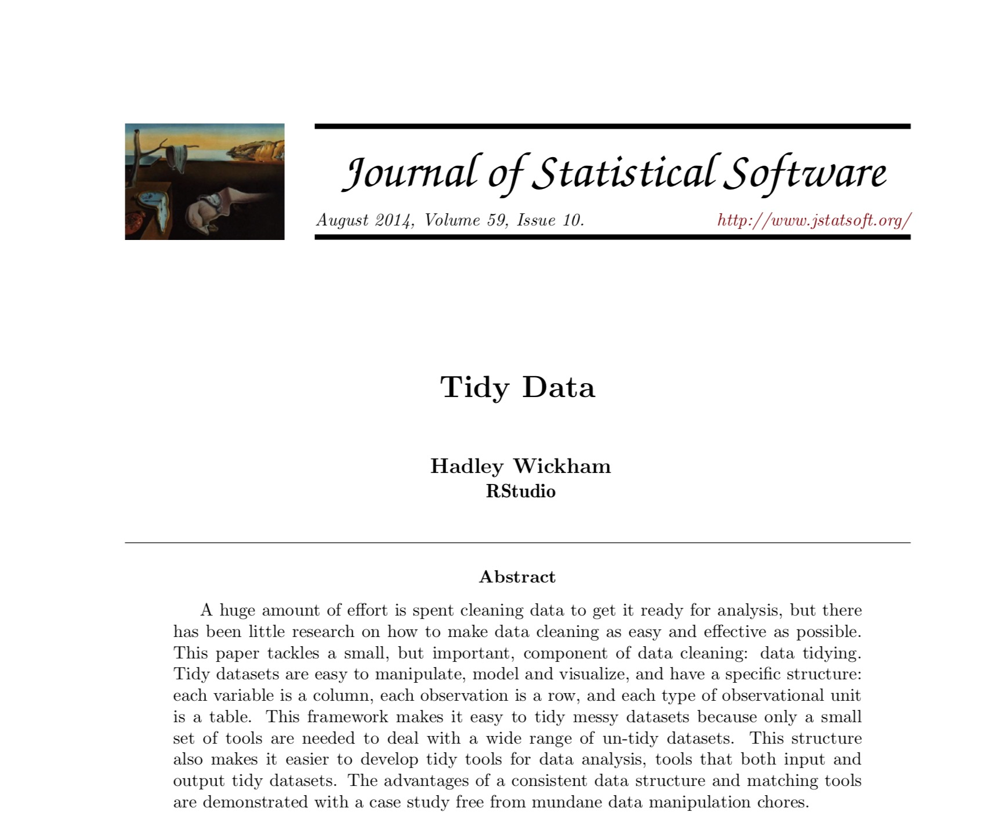

<style>
.section .reveal .state-background {
    background: white;}
.section .reveal h1,
.section .reveal p {
    color: black;
    position: relative;
    top: 4%;}
    </style>
    
<style>

.footer {
    color: black; background: white;
    position: fixed; top: 100%;
    text-align:left; width:100%;
}

</style>

Data Wrangling
========================================================
author: Cory Whitney
font-family: 'Helvetica'
date: "2019-03-18"
width: 1920
height: 1080
css: mySlideTemplate.css


<div class="footer"></small>cory.whitney@uni-bonn.de </small></div>

Overview
====================================
incremental: true
right: 70%


***
- Notes on R
- Tidy code style using tidyR 
- Clean and intuitive functions using dplyr
- Concise code using magrittr 'Ceci n'est pas une pipe'


Notes on R: About process
========================================================
incremental: true

- "[...] writing R code is a hedonistically artistic, left-brained, paint-in-your-hair sort of experience [...] 
- learn how to code the same way we learned how to catch salamanders as children – trial and error, flipping over rocks till we get a reward [...] 
- once the ecstasy of creation has swept over us, we awake late the next morning to find our canvas covered with 2100 lines of R code [...] 
- Heads throbbing with a statistical absinthe hangover, we trudge through it slowly over days, trying to figure out what we did."

Andrew MacDonald <small>@polesasunder </small>

<div class="footer" style="margin-top;font-size:60%;"> 
thestudyofthehousehold.com </div>


Notes on R: Focus
========================================================
incremental: true
right: 90%
***


Notes on R: Keeping track of work
========================================================
incremental: true
right: 80%


Keep it tidy
***

Use ‘#’ to annotate and not run

If not Rmarkdown then at least use ‘----’ or ‘####’ 

#Section 1----

#Section 2####

#Section 3####

<span style="font-weight:bold; color:red;">TOC in upper right console</span>


<div class="footer" style="margin-top;font-size:60%;"> 
http://style.tidyverse.org/ </div>

Notes on R: tidy tools manifesto
========================================================
incremental: true
right: 80%


Keep it tidy
***


```r
# The easiest way to get libraries for today is to install the whole tidyverse:
#install.packages("tidyverse")
library(tidyverse)
browseVignettes(package = "tidyverse")
```

The tidy tools manifesto

<!--    -->
<!-- Hadley Wickham -->
<div class="footer"></small>http://style.tidyverse.org/ </small></div>

Notes on R: tidyR process
========================================================
incremental: true
right: 80%


Keep it tidy
***


Good coding style is like correct punctuation:
withoutitthingsarehardtoread

<div class="footer" style="margin-top;font-size:60%;"> 
http://style.tidyverse.org/ </div>

Notes on R: Keep your data tidy
========================================================
incremental: true
right: 80%


Keep it tidy
***

- Keep your data tidy
- When your data is tidy, each column is a variable, and each row is an observation
- Consistent structure lets you focus your struggle on questions about the data, not fighting to get the data into the right form for different functions


<div class="footer" style="margin-top;font-size:60%;"> 
http://style.tidyverse.org/ </div>

Notes on R: Tidy Data
========================================================
incremental: true

H. Wickham, Tidy Data, Journal of Statistical Software, 59(10)

Three things make a dataset tidy:
- Each variable with its own column.
- Each observation with its own row.
- Each value with its own cell.


<div class="footer" style="margin-top;font-size:60%;"> 
http://www.jstatsoft.org/v59/i10/paper </div>


Wrangling: transform
========================================================
incremental: true

- Once you have __tidy__ data, a common first step is to __transform__ it
- narrowing in on observations of interest
- creating new variables that are functions of existing variables
- calculating a set of summary statistics

 
<div class="footer"></small><small>http://www.codeastar.com/data-wrangling/</small> </small></div>

Wrangling: dplyr arguments
========================================================
incremental: true
<small>Format of __dplyr__</small>  


***
- __Arguments start with a data frame__
- __select__: return a subset of the columns
- __filter__: extract a subset of rows
- __arrange__: reorder rows
- __rename__: rename variables
- __mutate__: add new variables and columns or transform
- __summarize__: generate tables of summary statistics

<div class="footer" style="margin-top;font-size:60%;"> 
https://dplyr.tidyverse.org/ </div>

Wrangling: dplyr library
========================================================
incremental: true
left: 70%
<small>Using __dplyr__</small>  


```r
library(dplyr)
```


 <small>genomicsclass.github.io/book/pages/dplyr_tutorial</small>

***


<small>Roger Peng</small>


<div class="footer" style="margin-top;font-size:60%;"> 
https://dplyr.tidyverse.org/ </div>


Wrangling: dplyr::select
========================================================
incremental: true
<small>Subsetting</small> 

__Select__


```r
aca_work_filter<-select(participants_data, academic_parents, working_hours_per_day)
```

```
  academic_parents working_hours_per_day
1                N                     8
2                Y                     8
3                N                     7
4                Y                    16
5                N                    12
6                N                    16
```

```r
non_aca_work_filter<-select(participants_data, -academic_parents, -working_hours_per_day)
```

```
  age gender continent_of_origin research_continent number_of_publications
1  33      F              Europe             Europe                      6
2  31      F       South America      South America                      0
3  30      F       South America      South America                      1
4  28      M              Africa             Africa                      1
5  30      M              Africa             Africa                      3
6  30      M              Africa             Africa                      3
  number_of_siblings km_home_to_zef years_of_study days_to_email_response
1                  1            1.7             20                      1
2                  2           40.0              9                      1
3                  2        10370.0              7                      1
4                  1           15.0              3                      1
5                  5            6.0              7                      1
6                  4            8.3             10                      2
  letters_in_first_name
1                     4
2                     6
3                     7
4                     7
5                     6
6                     6
```
<div class="footer" style="margin-top;font-size:60%;"> 
https://dplyr.tidyverse.org/ </div>


Wrangling: dplyr::filter
========================================================
incremental: true
<small>Subsetting</small> 


__Filter__

```r
work_filter<-filter(participants_data, working_hours_per_day >10)
```

```r
work_name_filter<-filter(participants_data, working_hours_per_day >10 & letters_in_first_name >6)
work_name_filter
```

```
  age gender continent_of_origin research_continent number_of_publications
1  28      M              Africa             Africa                      1
  working_hours_per_day number_of_siblings academic_parents km_home_to_zef
1                    16                  1                Y             15
  years_of_study days_to_email_response letters_in_first_name
1              3                      1                     7
```

<div class="footer" style="margin-top;font-size:60%;"> 
https://dplyr.tidyverse.org/ </div>


Wrangling: dplyr::rename
========================================================
incremental: true
<small> __Rename__ </small> 


```r
participants_data <- rename(participants_data, name_length = letters_in_first_name)
```

```r
participants_data <- rename(participants_data,
daily_labor = working_hours_per_day)
names(participants_data)
```

```
 [1] "age"                    "gender"                
 [3] "continent_of_origin"    "research_continent"    
 [5] "number_of_publications" "daily_labor"           
 [7] "number_of_siblings"     "academic_parents"      
 [9] "km_home_to_zef"         "years_of_study"        
[11] "days_to_email_response" "name_length"           
```
<div class="footer" style="margin-top;font-size:60%;"> 
https://dplyr.tidyverse.org/ </div>


Wrangling: dplyr::mutate
========================================================
incremental: true
<small> __Mutate__ </small> 


```r
participants_data <- mutate(participants_data, daily_labor*mean(daily_labor, na.rm=T))
# head(participants_data)
```


```r
participants_data <- mutate(participants_data, number_of_siblings -mean(number_of_siblings))
head(participants_data)
```

```
  age gender continent_of_origin research_continent number_of_publications
1  33      F              Europe             Europe                      6
2  31      F       South America      South America                      0
3  30      F       South America      South America                      1
4  28      M              Africa             Africa                      1
5  30      M              Africa             Africa                      3
6  30      M              Africa             Africa                      3
  daily_labor number_of_siblings academic_parents km_home_to_zef
1           8                  1                N            1.7
2           8                  2                Y           40.0
3           7                  2                N        10370.0
4          16                  1                Y           15.0
5          12                  5                N            6.0
6          16                  4                N            8.3
  years_of_study days_to_email_response name_length
1             20                      1           4
2              9                      1           6
3              7                      1           7
4              3                      1           7
5              7                      1           6
6             10                      2           6
  daily_labor * mean(daily_labor, na.rm = T)
1                                   77.33333
2                                   77.33333
3                                   67.66667
4                                  154.66667
5                                  116.00000
6                                  154.66667
  number_of_siblings - mean(number_of_siblings)
1                                    -1.7777778
2                                    -0.7777778
3                                    -0.7777778
4                                    -1.7777778
5                                     2.2222222
6                                     1.2222222
```
<div class="footer"></small><small>https://dplyr.tidyverse.org/ </small> </small></div>

Wrangling: dplyr::group_by
========================================================
incremental: true
<small> __Group by__ </small>  create a commute category


```r
participants_data <- mutate(participants_data, commute = factor(1* (km_home_to_zef > 10), labels = c("commuter", "local")))
```


```r
commuter_data <- group_by(participants_data, commute)
commuter_data
```

```
# A tibble: 9 x 15
# Groups:   commute [2]
    age gender continent_of_or… research_contin… number_of_publi…
  <dbl> <fct>  <fct>            <fct>                       <dbl>
1    33 F      Europe           Europe                          6
2    31 F      South America    South America                   0
3    30 F      South America    South America                   1
4    28 M      Africa           Africa                          1
5    30 M      Africa           Africa                          3
6    30 M      Africa           Africa                          3
7    33 F      Africa           Africa                          0
8    30 F      South America    South America                   2
9    27 M      Europe           Europe                          0
# … with 10 more variables: daily_labor <dbl>, number_of_siblings <dbl>,
#   academic_parents <fct>, km_home_to_zef <dbl>, years_of_study <dbl>,
#   days_to_email_response <dbl>, name_length <dbl>, `daily_labor *
#   mean(daily_labor, na.rm = T)` <dbl>, `number_of_siblings -
#   mean(number_of_siblings)` <dbl>, commute <fct>
```
<div class="footer" style="margin-top;font-size:60%;"> 
https://dplyr.tidyverse.org/ </div>


Wrangling: dplyr::summarize
========================================================
incremental: true
<small> __Summarize__ </small>  <small>get a summary of travel times and days to response</small>


```r
commuter_summary <- summarize(commuter_data, mean(days_to_email_response), median(name_length))
commuter_summary
```

```
# A tibble: 2 x 3
  commute  `mean(days_to_email_response)` `median(name_length)`
  <fct>                             <dbl>                 <dbl>
1 commuter                           1.8                      5
2 local                              1.25                     7
```


</small> <div class="footer"></small><small>https://dplyr.tidyverse.org/ </small> </small></div>

Wrangling: magrittr
========================================================
incremental: true
<small> __Pipeline %>%__ </small> 
- Do all the previous with a pipeline %>%

```r
pipe_data <- participants_data %>% 
  mutate(commute = factor(1* (km_home_to_zef > 10), 
                          labels = c("commuter", "local"))) %>% 
  group_by(commute) %>% 
  summarize(mean(days_to_email_response), median(name_length), 
            max(years_of_study)) %>% 
  as.data.frame

pipe_data
```

```
   commute mean(days_to_email_response) median(name_length)
1 commuter                         1.80                   5
2    local                         1.25                   7
  max(years_of_study)
1                  20
2                   9
```

- Make your own query with `dplyr` and `magrittr`

purrr: Apply a function to each element of a vector
========================================================
incremental: true


```r
# Alternatively, install just purrr:
library(purrr)

# Or the the development version from GitHub:
# install.packages("devtools")
#devtools::install_github("tidyverse/purrr")
```

purr Cheatsheet

purrr: Use
========================================================


Use purrr to solve: split a data frame into pieces, fit a model to each piece, compute the summary, then extract the R^2.


```r
library(purrr)

purrr_regression <- mtcars %>%
  split(.$cyl) %>% # from base R
  map(~ lm(mpg ~ wt, data = .)) %>%
  map(summary) %>%
  map_dbl("r.squared")

purrr_regression
```

```
        4         6         8 
0.5086326 0.4645102 0.4229655 
```

https://purrr.tidyverse.org/


Tasks for the afternoon: Basic
========================================================
incremental: true


***
- Create a dataset with a number of different variables of the course participants
- Data transformation (subsetting with base R and dplyr)
- Use magrittr pipeline to perform series of tasks with dplyr verbs
- Merge datasets in base R and dplyr
- Descriptive statistics (checks in base R and dplyr)

<div class="footer" style="margin-top;font-size:60%;"> 
cory.whitney@uni-bonn.de </div>


Tasks for the afternoon: Advanced
========================================================
incremental: true


***
- Use other R data set (e.g. iris, diamonds, ethnobotanydata) to work through  tasks 
  - long format in base
  - short format with magrittr pipeline
  - Descriptive statistics (checks in base R and dplyr)

<div class="footer" style="margin-top;font-size:60%;"> 
cory.whitney@uni-bonn.de </div>

