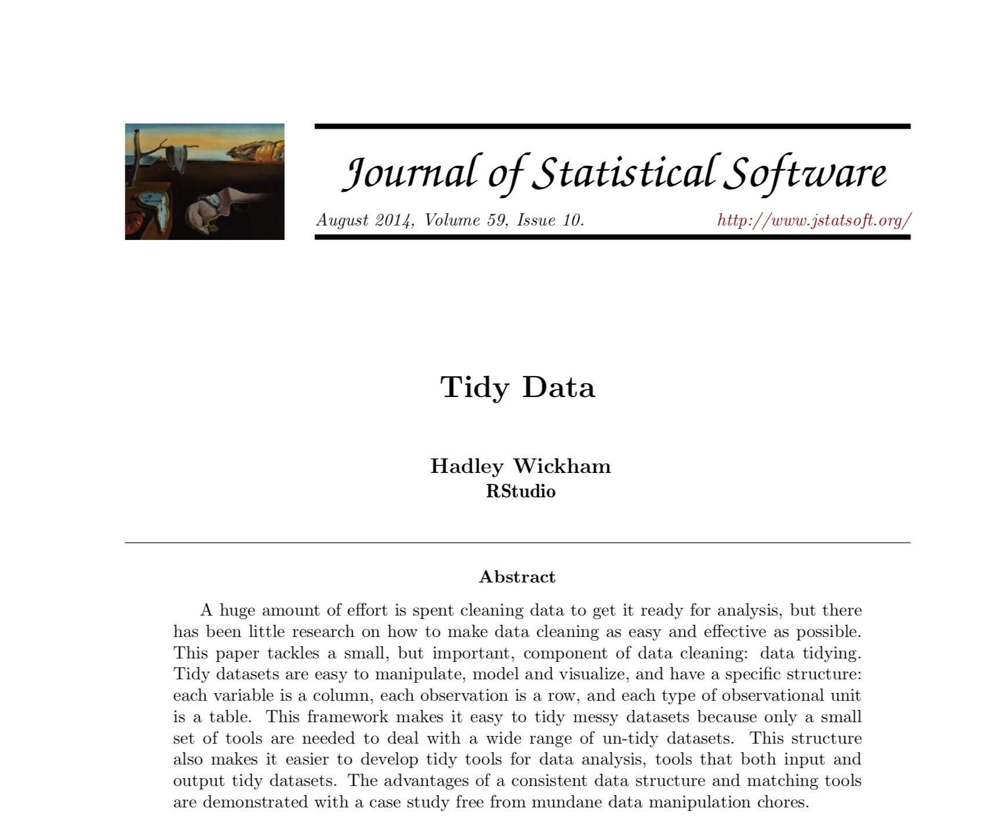
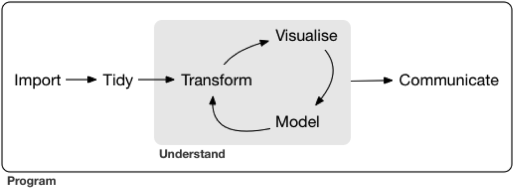
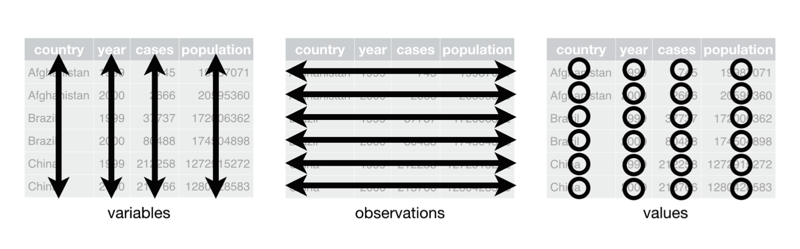

<style>
.section .reveal .state-background {
    background: white;}
.section .reveal h1,
.section .reveal p {
    color: black;
    position: relative;
    top: 1%;}
</style>
    
<style>
.footer {
    color: black; background: white;
    position: fixed; top: 100%;
    text-align:left; width:100%;
}

</style>

<!-- enable caching globally for the presentation with this code chunk: If you run into problems with cached output you can always use the Clear Knitr Cache command on the More menu to rebuild your presentation without previously cached output. -->
    


Data Wrangling
========================================================
author: Cory Whitney
font-family: 'Helvetica'
autosize: true
css: mySlideTemplate.css


<div class="footer"></small>cory.whitney@uni-bonn.de </small></div>

Overview
====================================
incremental: true
right: 70%


***
- Notes on R
- Tidy code style using tidyR 
- Clean and intuitive functions using dplyr
- Concise code using magrittr 'Ceci n'est pas une pipe'


Notes on R: About process
========================================================
incremental: true

- "[...] writing R code is a hedonistically artistic, left-brained, paint-in-your-hair sort of experience [...] 
- learn how to code the same way we learned how to catch salamanders as children – trial and error, flipping over rocks till we get a reward [...] 
- once the ecstasy of creation has swept over us, we awake late the next morning to find our canvas covered with 2100 lines of R code [...] 
- Heads throbbing with a statistical absinthe hangover, we trudge through it slowly over days, trying to figure out what we did."

Andrew MacDonald  @polesasunder </small>


Notes on R: Focus
========================================================


Notes on R: Keeping track of work
========================================================
incremental: true
right: 80%


Keep it tidy
***

Use ‘#’ to annotate and not run

If not Rmarkdown then at least use ‘----’ or ‘####’ 

#Section 1----

#Section 2####

#Section 3####

<span style="font-weight:bold; color:red;">TOC in upper right console</span>


<div class="footer" style="margin-top;font-size:60%;"> 
http://style.tidyverse.org/ </div>

Notes on tidy R
========================================================
incremental: true
right: 80%


Keep it tidy
***
Check your R version
```
version
```
The easiest way to get libraries for today is to install the whole tidyverse:


```r
library(tidyverse)
```
<div class="footer" style="margin-top;font-size:60%;"> 
http://style.tidyverse.org/ </div>

Notes on tidy R browseVignettes
========================================================
incremental: true


Keep it tidy

Learn about tidyverse with browseVignettes:


```r
browseVignettes(package = "tidyverse")
```
<div class="footer" style="margin-top;font-size:60%;"> 
http://style.tidyverse.org/ </div>


The tidy tools manifesto
========================================================
incremental: true

<!--    -->
<!-- Hadley Wickham -->

Notes on R: tidyR process
========================================================
incremental: true
right: 80%


Keep it tidy
***



- Good coding style is like correct punctuation:
- withoutitthingsarehardtoread

<div class="footer" style="margin-top;font-size:60%;"> 
http://style.tidyverse.org/ </div>

Notes on R: Keep your data tidy
========================================================
incremental: true
right: 80%


Keep it tidy
***

- Keep your data tidy
- When your data is tidy, each column is a variable, and each row is an observation
- Consistent structure lets you focus your struggle on questions about the data, not fighting to get the data into the right form for different functions


<div class="footer" style="margin-top;font-size:60%;"> 
http://style.tidyverse.org/ </div>

Notes on R: Tidy Data
========================================================
incremental: true

Three things make a dataset tidy:
- Each variable with its own column.
- Each observation with its own row.
- Each value with its own cell.



<div class="footer" style="margin-top;font-size:60%;"> 
H. Wickham, Tidy Data, Journal of Statistical Software, 59(10) www.jstatsoft.org/v59/i10/paper </div>


Wrangling: transform
========================================================
incremental: true

- Once you have __tidy__ data, a common first step is to __transform__ it
- narrowing in on observations of interest
- creating new variables that are functions of existing variables
- calculating a set of summary statistics

 www.codeastar.com/data-wrangling/ 

Wrangling: dplyr arguments
========================================================
incremental: true
<small>Format of __dplyr__</small>  

 
Arguments start with a data frame

***
- __select__: return a subset of the columns
- __filter__: extract a subset of rows
- __rename__: rename variables
- __mutate__: add new variables and columns or transform
- __group_by__: split data into groups
- __summarize__: generate tables of summary statistics

<div class="footer" style="margin-top;font-size:60%;"> 
https://dplyr.tidyverse.org/ </div>

Getting your data in R
========================================================
incremental: true
<small>Load data</small> 

- Load the data

```r
participants_data <- read.csv("participants_data.csv")
```
- Keep your data in the same folder structure as .RProj
- at or below the level of .RProj

Wrangling: dplyr library
========================================================
incremental: true
left: 40%
<small>Using __dplyr__</small>  


```r
library(dplyr)
```

and others we need today

```r
library(knitr)
library(tidyr)
library(dplyr)
library(magrittr)
```

***

<small>Roger Peng</small> 

 <small>genomicsclass.github.io/book/pages/dplyr_tutorial</small>


<div class="footer" style="margin-top;font-size:60%;"> 
https://dplyr.tidyverse.org/ </div>


Wrangling: dplyr::select aca_work_filter
========================================================
incremental: true
<small>Subsetting</small> 

__Select__


```r
aca_work_filter <- select(participants_data, academic_parents, working_hours_per_day)
```

<div class="footer" style="margin-top;font-size:60%;"> 
https://dplyr.tidyverse.org/ </div>

Wrangling: dplyr::select non_aca_work_filter
========================================================
incremental: true
<small>Subsetting</small> 

__Select__


```r
non_aca_work_filter <- select(participants_data, -academic_parents, -working_hours_per_day)
```

<div class="footer" style="margin-top;font-size:60%;"> 
https://dplyr.tidyverse.org/ </div>

Wrangling: dplyr::filter work_filter
========================================================
incremental: true
<small>Subsetting</small> 


__Filter__

```r
work_filter <- filter(participants_data, working_hours_per_day >10)
```

<div class="footer" style="margin-top;font-size:60%;"> 
https://dplyr.tidyverse.org/ </div>

Wrangling: dplyr::filter work_name_filter
========================================================
incremental: true
<small>Subsetting</small> 


__Filter__


```r
work_name_filter <- filter(participants_data, working_hours_per_day >10 & letters_in_first_name >6)
```

<div class="footer" style="margin-top;font-size:60%;"> 
https://dplyr.tidyverse.org/ </div>

Wrangling: dplyr::rename name_length
========================================================
incremental: true
<small> __Rename__ </small> 


```r
participants_data <- rename(participants_data, name_length = letters_in_first_name)
```

<div class="footer" style="margin-top;font-size:60%;"> 
https://dplyr.tidyverse.org/ </div>

Wrangling: dplyr::rename daily_labor
========================================================
incremental: true
<small> __Rename__ </small> 


```r
participants_data <- rename(participants_data,
daily_labor = working_hours_per_day)
```
<div class="footer" style="margin-top;font-size:60%;"> 
https://dplyr.tidyverse.org/ </div>

Wrangling: dplyr::mutate
========================================================
incremental: true
<small> __Mutate__ </small> 


```r
participants_data <- mutate(participants_data, labor_mean = daily_labor*mean(daily_labor))
```

<div class="footer"></small><small>https://dplyr.tidyverse.org/ </small> </small></div>

Wrangling: dplyr::mutate
========================================================
incremental: true
<small> __Mutate__ </small> 

Create a commute category


```r
participants_data <- mutate(participants_data, commute = ifelse(km_home_to_zef > 10, "commuter", "local"))
```

<div class="footer"></small><small>https://dplyr.tidyverse.org/ </small> </small></div>

Wrangling: dplyr::group_by
========================================================
incremental: true
<small> __Group__ </small>  <small>group data by commuters and non-commuters</small>


```r
commuter_data <- group_by(participants_data, commute)
```

<div class="footer"></small><small>https://dplyr.tidyverse.org/ </small> </small></div>

Wrangling: dplyr::summarize
========================================================
incremental: true
<small> __Summarize__ </small>  <small>get a summary of travel times and days to response</small>


```r
commuter_summary <- summarize(commuter_data, mean(days_to_email_response), median(name_length))
```


Wrangling: magrittr use
========================================================
incremental: true
__Pipeline %>%__ 
- Do all the previous with a pipeline %>%

```r
pipe_data <- participants_data %>% 
   mutate(commute = ifelse(
     km_home_to_zef > 10, 
     "commuter", "local")) %>% 
  group_by(commute) %>% 
  summarize(mean(days_to_email_response), 
            median(name_length), 
            max(years_of_study)) %>% 
  as.data.frame
```


Wrangling: magrittr try
========================================================
incremental: true
 __Pipeline %>%__  

- Work on your own with a pipeline %>%

- Make your own query with `dplyr` and `magrittr`

purrr: Apply a function to each element of a vector
========================================================
incremental: true


```r
library(purrr)
```

purr Cheatsheet

Using purrr
========================================================


Use purrr to solve: split a data frame into pieces, fit a model to each piece, compute the summary, then extract the R^2.

https://purrr.tidyverse.org/

http://varianceexplained.org/r/teach-tidyverse/

Using purrr for regression
========================================================

Use purrr 


```r
library(purrr)

participants_data_regression <- 
    participants_data %>%
      split(.$batch) %>% # from base R
        map(~ 
          lm(days_to_email_response ~ 
                daily_labor, 
                 data = .)) %>%
  map(summary) %>%
  map_dbl("r.squared")
```


Tasks for the afternoon: Basic
========================================================
incremental: true


***
- Perform the above assessment of participants_data only where gender is 'F'
- Use the magrittr pipeline to perform the tasks in short form

<div class="footer" style="margin-top;font-size:60%;"> 
cory.whitney@uni-bonn.de </div>


Tasks for the afternoon: Advanced
========================================================
left: 20%
incremental: true


***
Work through tasks on the diamonds data in long format in base and short format with magrittr pipeline:
- select: carat and price
- filter: only where carat is > 0.5
- rename: rename price as cost
- mutate: name expensive or cheap if greater than mean of price/cost
- group_by: split into cheap and expensive
- summarize: give summary statistics

<div class="footer" style="margin-top;font-size:60%;"> 
cory.whitney@uni-bonn.de </div>

