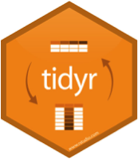
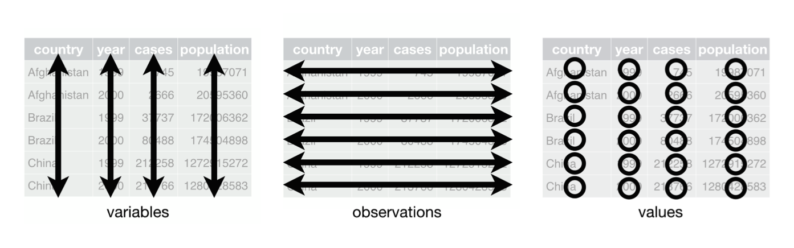

## Data Wrangling Part 2

{width=1in}
{width=1in}
{width=1.5in}

The video below offers an overview of the content in covered in this section of the tutorial. Keep in mind that I did not yet have your data when I recorded this so the results of my scripts may be slightly different than yours. Feel free to watch the video and follow along or simply work through the tutorial. 

<iframe width="560" height="315" src="https://www.youtube.com/embed/A6H12OW03IE" frameborder="0" allowfullscreen></iframe>


## Notes on tidy R

{width=1in}

Keep it tidy

Check your R version by running the following code in the R console:

```
version
```

The easiest way to get libraries for today is to install the whole tidyverse [@R-tidyverse] by typing `install.packages("tidyverse)` in the R console and then running `library(tidyverse)`:

```{r wrangle2-load-tidyverse}
library(tidyverse)
```
 
http://style.tidyverse.org/

## Notes on tidy R browseVignettes

{width=1in}

Keep it tidy

Learn about tidyverse by running the following code in the R console: `browseVignettes(package = "tidyverse")`
 
## The tidy tools manifesto

{width=5in}
<!--    -->
<!-- Hadley Wickham -->

Read the [full manifesto here](http://style.tidyverse.org/).

## Notes on R: tidyR process

{width=1in}

Keep it tidy

{width=5in}

- Good coding style is like correct punctuation:
- withoutitthingsarehardtoread
 
- When your data is tidy, each column is a variable, and each row is an observation
- Consistent structure lets you focus your struggle on questions about the data, not fighting to get the data into the right form for different functions

{width=1in}

http://style.tidyverse.org/

## Notes on R: Tidy Data

Three things make a dataset tidy:
- Each variable with its own column.
- Each observation with its own row.
- Each value with its own cell.

{width=5in}

Read more about this from Wickham's paper in the Journal of Statistical Software.

H. Wickham, Tidy Data, Journal of Statistical Software, 59(10) www.jstatsoft.org/v59/i10/paper

## Wrangling: transform

- Once you have __tidy__ data, a common first step is to __transform__ it
- narrowing in on observations of interest
- creating new variables that are functions of existing variables
- calculating a set of summary statistics

{width=5in} www.codeastar.com/data-wrangling/ 

## Wrangling: dplyr arguments

Format of __dplyr__ 

{width=1in} 

{width=3in} 

Arguments start with a data frame

- __select__: return a subset of the columns
- __filter__: extract a subset of rows
- __rename__: rename variables
- __mutate__: add new variables and columns or transform
- __group_by__: split data into groups
- __summarize__: generate tables of summary statistics

https://dplyr.tidyverse.org/

## Getting your data in R

Load data 

{width=1in}

- Load the data

```{r wrangle2-participants-data}
participants_data <- read.csv("participants_data.csv")
```

- Keep your data in the same folder structure as .RProj
- at or below the level of .RProj

## Wrangling: dplyr library

Using __dplyr__ {width=1in}

```{r wrangle2-load-dplyr}
library(dplyr)
```

and others we need today

```{r wrangle2-knitr-etal}
library(knitr)
library(tidyr)
library(magrittr)
```

Roger Peng 
{width=1in}

{width=1in}
 genomicsclass.github.io/book/pages/dplyr_tutorial

https://dplyr.tidyverse.org/

## Wrangling: dplyr::select aca_work_filter

Subsetting {width=1in}

__Select__

```{r wrangle2-select-aca-parents}
aca_work_set <- select(participants_data, academic_parents, working_hours_per_day)
```

https://dplyr.tidyverse.org/

## Wrangling: dplyr::select non_aca_work_filter

Subsetting {width=1in}

__Select__

```{r wrangle2-select-non-aca-parents}
non_aca_work_set <- select(participants_data, -academic_parents, -working_hours_per_day)
```

https://dplyr.tidyverse.org/

## Wrangling: dplyr::filter work_filter

Subsetting {width=1in}

__Filter__
```{r wrangle2-filter-work}
work_filter <- filter(participants_data, working_hours_per_day >10)
```

https://dplyr.tidyverse.org/

## Wrangling: dplyr::filter work_name_filter

Subsetting {width=1in}

__Filter__

```{r wrangle2-filter-work-name}
work_name_filter <- filter(participants_data, working_hours_per_day >10 & letters_in_first_name >6)
```

 
https://dplyr.tidyverse.org/

## Wrangling: dplyr::rename name_length


 __Rename__  {width=1in}


```{r wrangle2-rename-letters}
participants_data <- rename(participants_data, name_length = letters_in_first_name)
```

 
https://dplyr.tidyverse.org/

## Wrangling: dplyr::rename daily_labor


 __Rename__  {width=1in}


```{r wrangle2-rename-work}
participants_data <- rename(participants_data,
daily_labor = working_hours_per_day)
```
 
https://dplyr.tidyverse.org/

## Wrangling: dplyr::mutate


 __Mutate__  {width=1in}

```{r wrangle2-mutate-labor}
participants_data <- mutate(participants_data, labor_mean = daily_labor*mean(daily_labor))
```

https://dplyr.tidyverse.org/  

## Wrangling: dplyr::mutate


 __Mutate__  {width=1in}

Create a commute category

```{r wrangle2-mutate-commute}
participants_data <- mutate(participants_data, commute = ifelse(km_home_to_zef > 10, "commuter", "local"))
```

https://dplyr.tidyverse.org/  

## Wrangling: dplyr::group_by


 __Group__  {width=1in} group data by commuters and non-commuters

```{r wrangle2-group-commute}
commuter_data <- group_by(participants_data, commute)
```

https://dplyr.tidyverse.org/  

## Wrangling: dplyr::summarize


 __Summarize__  {width=1in} get a summary of travel times and days to response

```{r wrangle2-summar-commute}
commuter_summary <- summarize(commuter_data, mean(days_to_email_response), median(name_length))
```


## Wrangling: magrittr use


__Pipeline %>%__ 
- Do all the previous with a pipeline %>%
```{r wrangle2-pipe-long}
pipe_data <- participants_data %>% 
   mutate(commute = ifelse(
     km_home_to_zef > 10, 
     "commuter", "local")) %>% 
  group_by(commute) %>% 
  summarize(mean(days_to_email_response), 
            median(name_length), 
            max(years_of_study)) %>% 
  as.data.frame
```


## Wrangling: magrittr try


 __Pipeline %>%__  {width=1in}

- Work on your own with a pipeline %>%

- Make your own query with `dplyr` and `magrittr`

## purrr: Apply a function to each element of a vector


{width=1in}

```{r wrangle2-purr-load}
library(purrr)
```

purr Cheatsheet

Using purrr


{width=1in}

Use purrr to solve: split a data frame into pieces, fit a model to each piece, compute the summary, then extract the R^2.

https://purrr.tidyverse.org/

http://varianceexplained.org/r/teach-tidyverse/

Using purrr for regression


Use purrr 

```{r wrangle2-purr-regression}
library(purrr)

participants_data_regression <- 
    participants_data %>%
      split(.$batch) %>% # from base R
        map(~ 
          lm(days_to_email_response ~ 
                daily_labor, 
                 data = .)) %>%
  map(summary) %>%
  map_dbl("r.squared")

```


## Tasks for the afternoon: Basic


{width=1in}
{width=1in}

- Perform the above assessment of participants_data only where gender is 'F'
- Use the magrittr pipeline to perform the tasks in short form


## Tasks for the afternoon: Advanced


{width=1in}
{width=1in}
{width=1in}


Work through tasks on the diamonds data in long format in base and short format with magrittr pipeline:
- select: carat and price
- filter: only where carat is > 0.5
- rename: rename price as cost
- mutate: name expensive or cheap if greater than mean of price/cost
- group_by: split into cheap and expensive
- summarize: give summary statistics


