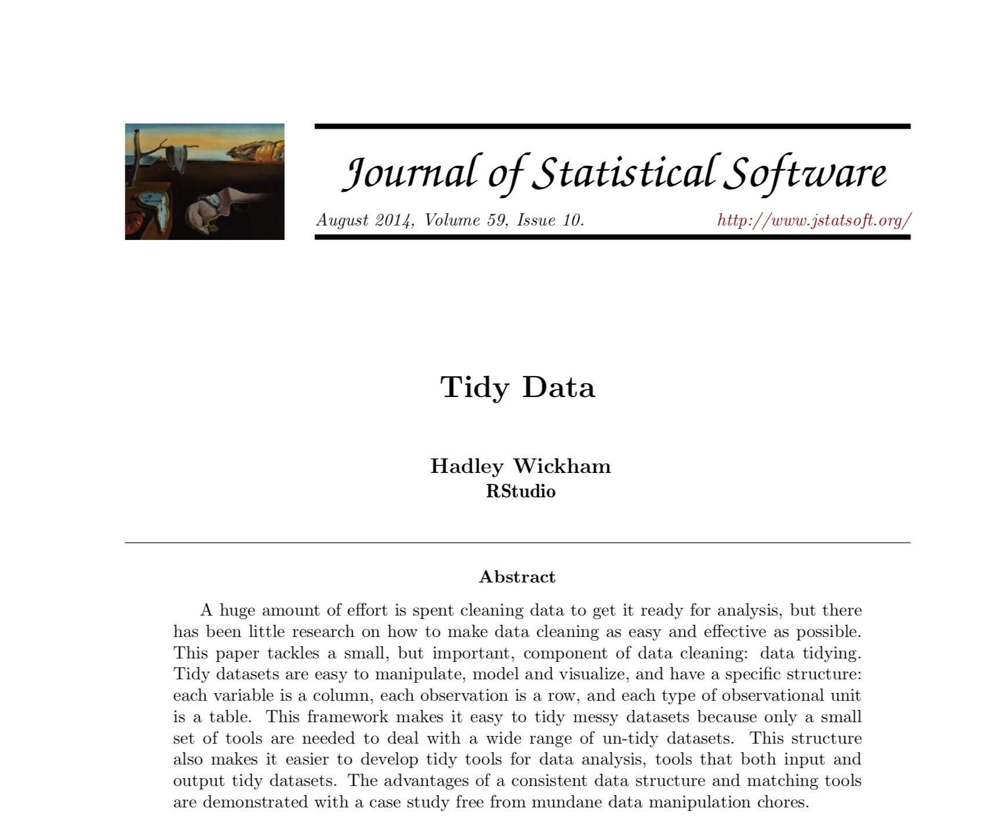

<style>
.section .reveal .state-background {
    background: white;}
.section .reveal h1,
.section .reveal p {
    color: black;
    position: relative;
    top: 1%;}
</style>
    
<style>
.footer {
    color: black; background: white;
    position: fixed; top: 100%;
    text-align:left; width:100%;
}

</style>

<!-- enable caching globally for the presentation with this code chunk: If you run into problems with cached output you can always use the Clear Knitr Cache command on the More menu to rebuild your presentation without previously cached output. -->
    


Data Wrangling
========================================================
author: Cory Whitney
font-family: 'Helvetica'
autosize: true
css: mySlideTemplate.css


<div class="footer"></small>cory.whitney@uni-bonn.de </small></div>

Overview
====================================
incremental: true
right: 70%


***
- Notes on R
- Tidy code style using tidyR 
- Clean and intuitive functions using dplyr
- Concise code using magrittr 'Ceci n'est pas une pipe'


Notes on R: About process
========================================================
incremental: true

- "[...] writing R code is a hedonistically artistic, left-brained, paint-in-your-hair sort of experience [...] 
- learn how to code the same way we learned how to catch salamanders as children – trial and error, flipping over rocks till we get a reward [...] 
- once the ecstasy of creation has swept over us, we awake late the next morning to find our canvas covered with 2100 lines of R code [...] 
- Heads throbbing with a statistical absinthe hangover, we trudge through it slowly over days, trying to figure out what we did."

Andrew MacDonald  @polesasunder </small>


Notes on R: Focus
========================================================


Notes on R: Keeping track of work
========================================================
incremental: true
right: 80%


Keep it tidy
***

Use `#` to annotate and not run

If not Rmarkdown then at least use `----` or `####` 

`# Section 1 ----`

`# Section 2 ####`

`# Section 3 ####`

<span style="font-weight:bold; color:red;">TOC in upper right console</span>

<!-- End Part 1 -->

<!-- Begin Part 2 -->

<div class="footer" style="margin-top;font-size:60%;"> 
http://style.tidyverse.org/ </div>

Notes on tidy R
========================================================
incremental: true
right: 80%


Keep it tidy
***
Check your R version
```
version
```
The easiest way to get libraries for today is to install the whole tidyverse:


```r
library(tidyverse)
```
<div class="footer" style="margin-top;font-size:60%;"> 
http://style.tidyverse.org/ </div>

Notes on tidy R browseVignettes
========================================================
incremental: true


Keep it tidy

Learn about tidyverse with browseVignettes:


```r
browseVignettes(package = "tidyverse")
```
<div class="footer" style="margin-top;font-size:60%;"> 
http://style.tidyverse.org/ </div>


The tidy tools manifesto
========================================================
incremental: true

<!--    -->
<!-- Hadley Wickham -->

Notes on R: tidyR process
========================================================
incremental: true
right: 80%


Keep it tidy
***


- Good coding style is like correct punctuation:
- withoutitthingsarehardtoread

<div class="footer" style="margin-top;font-size:60%;"> 
http://style.tidyverse.org/ </div>

Notes on R: Keep your data tidy
========================================================
incremental: true
right: 80%


Keep it tidy
***

- Keep your data tidy
- When your data is tidy, each column is a variable, and each row is an observation
- Consistent structure lets you focus your struggle on questions about the data, not fighting to get the data into the right form for different functions


<div class="footer" style="margin-top;font-size:60%;"> 
http://style.tidyverse.org/ </div>

Notes on R: Tidy Data
========================================================
incremental: true

Three things make a dataset tidy:
- Each variable with its own column.
- Each observation with its own row.
- Each value with its own cell.


<div class="footer" style="margin-top;font-size:60%;"> 
H. Wickham, Tidy Data, Journal of Statistical Software, 59(10) www.jstatsoft.org/v59/i10/paper </div>


Wrangling: transform
========================================================
incremental: true

- Once you have __tidy__ data, a common first step is to __transform__ it
- narrowing in on observations of interest
- creating new variables that are functions of existing variables
- calculating a set of summary statistics

 www.codeastar.com/data-wrangling/ 

Wrangling: dplyr arguments
========================================================
incremental: true
<small>Format of __dplyr__</small>  

 
Arguments start with a data frame

***
- __select__: return a subset of the columns
- __filter__: extract a subset of rows
- __rename__: rename variables
- __mutate__: add new variables and columns or transform
- __group_by__: split data into groups
- __summarize__: generate tables of summary statistics

<div class="footer" style="margin-top;font-size:60%;"> 
https://dplyr.tidyverse.org/ </div>

Getting your data in R
========================================================
incremental: true
<small>Load data</small> 

- Load the data

```r
participants_data <- read.csv("participants_data.csv")
```
- Keep your data in the same folder structure as .RProj
- at or below the level of .RProj

Use `head` in R
========================================================
incremental: true
<small>Load data</small> 

- Look at the top rows of the data with the `head` function.

```r
head(participants_data)
```

```
  batch age gender continent_of_origin research_continent
1  2017  33      F              Europe             Europe
2  2017  31      F       South America      South America
3  2017  30      F       South America      South America
4  2017  28      M              Africa             Africa
5  2017  30      M              Africa             Africa
6  2017  30      M              Africa             Africa
  number_of_publications working_hours_per_day number_of_siblings
1                      6                     8                  1
2                      0                     8                  2
3                      1                     7                  2
4                      1                    16                  1
5                      3                    12                  5
6                      3                    16                  4
  academic_parents km_home_to_zef years_of_study days_to_email_response
1                N            1.7             20                      1
2                Y           40.0              9                      1
3                N        10370.0              7                      1
4                Y           15.0              3                      1
5                N            6.0              7                      1
6                N            8.3             10                      2
  letters_in_first_name
1                     4
2                     6
3                     7
4                     7
5                     6
6                     6
```

Use `names` in R
========================================================
incremental: true
<small>Load data</small> 

- Check the names of the variables in the data with the `names` function.

```r
head(participants_data)
```

```
  batch age gender continent_of_origin research_continent
1  2017  33      F              Europe             Europe
2  2017  31      F       South America      South America
3  2017  30      F       South America      South America
4  2017  28      M              Africa             Africa
5  2017  30      M              Africa             Africa
6  2017  30      M              Africa             Africa
  number_of_publications working_hours_per_day number_of_siblings
1                      6                     8                  1
2                      0                     8                  2
3                      1                     7                  2
4                      1                    16                  1
5                      3                    12                  5
6                      3                    16                  4
  academic_parents km_home_to_zef years_of_study days_to_email_response
1                N            1.7             20                      1
2                Y           40.0              9                      1
3                N        10370.0              7                      1
4                Y           15.0              3                      1
5                N            6.0              7                      1
6                N            8.3             10                      2
  letters_in_first_name
1                     4
2                     6
3                     7
4                     7
5                     6
6                     6
```

Use `str` in R
========================================================
incremental: true
<small>Load data</small> 

- Look at the structure of the data with the `str` function.

```r
str(participants_data)
```

```
'data.frame':	32 obs. of  13 variables:
 $ batch                 : int  2017 2017 2017 2017 2017 2017 2017 2017 2017 2018 ...
 $ age                   : int  33 31 30 28 30 30 33 30 27 32 ...
 $ gender                : chr  "F" "F" "F" "M" ...
 $ continent_of_origin   : chr  "Europe" "South America" "South America" "Africa" ...
 $ research_continent    : chr  "Europe" "South America" "South America" "Africa" ...
 $ number_of_publications: int  6 0 1 1 3 3 0 2 0 2 ...
 $ working_hours_per_day : int  8 8 7 16 12 16 3 8 9 8 ...
 $ number_of_siblings    : int  1 2 2 1 5 4 7 1 2 3 ...
 $ academic_parents      : chr  "N" "Y" "N" "Y" ...
 $ km_home_to_zef        : num  1.7 40 10370 15 6 ...
 $ years_of_study        : int  20 9 7 3 7 10 6 7 6 20 ...
 $ days_to_email_response: int  1 1 1 1 1 2 2 2 3 3 ...
 $ letters_in_first_name : int  4 6 7 7 6 6 5 7 5 4 ...
```

Use `$` in R
========================================================
incremental: true
<small>Load data</small> 

- Call a particular variable in your data with `$`

```r
participants_data$age
```

```
 [1] 33 31 30 28 30 30 33 30 27 32 32 36 43 32 28 28 33 31 34 29 31 37 34 23 35
[26] 37 29 32 27 36 29 32
```


Wrangling: dplyr library
========================================================
incremental: true
left: 40%
<small>Using __dplyr__</small>  


```r
library(dplyr)
```

and others we need today

```r
library(knitr)
library(tidyr)
library(magrittr)
```


Tasks to test your new skills
========================================================
left: 20%
incremental: true


***
Work through tasks on the `diamonds` data in long format in base and short format with magrittr pipeline:

- select: carat and price
- filter: only where carat is > 0.5
- rename: rename price as cost
- mutate: name expensive if greater than mean of price/cost or cheap otherwise
- group_by: split into cheap and expensive
- summarize: give summary statistics

<div class="footer" style="margin-top;font-size:60%;"> 
cory.whitney@uni-bonn.de </div>

