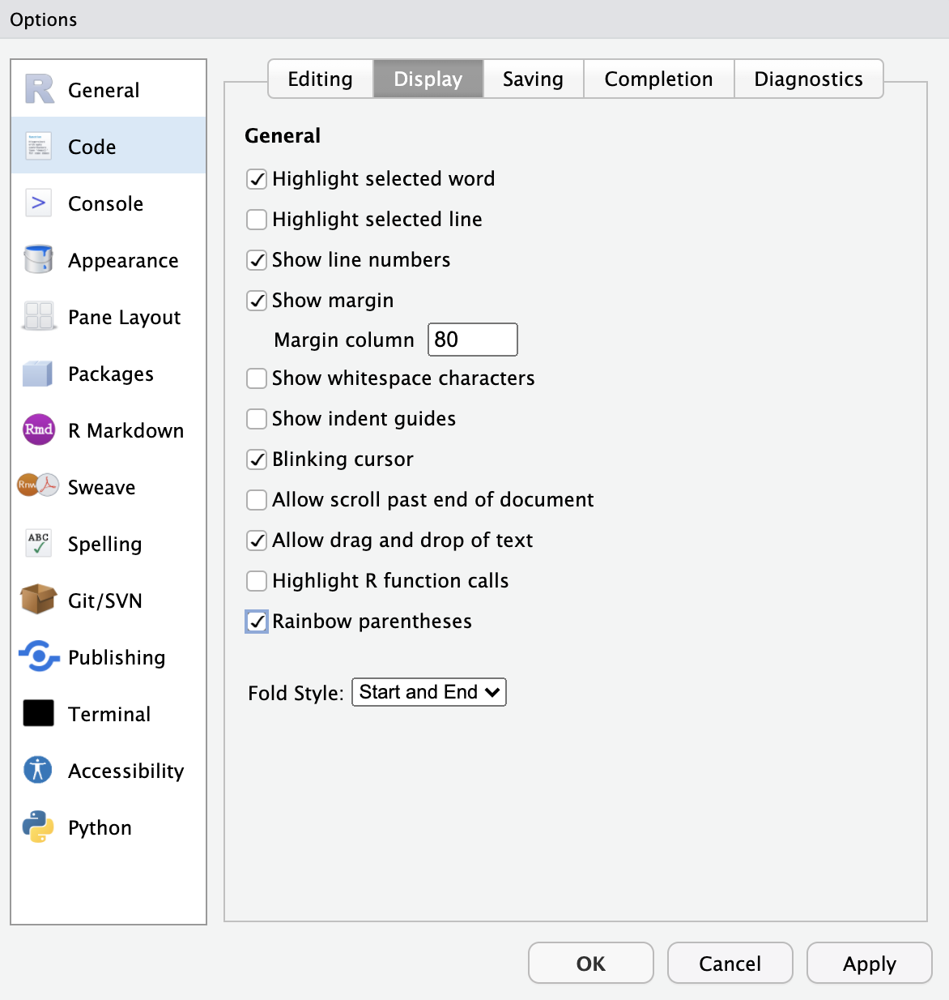

## Introduction

Welcome to this interactive tutorial on the R programming language. This tutorial runs in the `learnr` [@R-learnr] library and provides a `shiny` interface [@R-shiny] that will allow you the chance to interact with the examples in the R programming language. You may follow along by simply working in this browser. You may find the content and learning a bit more useful if you work on your own machine as well. This will require loading the necessary software. For this tutorial we will use functions from `tidyverse` [@R-tidyverse] libraries including `ggplot2` [@R-ggplot2], `dplyr` [@R-dplyr] and `magrittr` [@R-magrittr] among others in the [R programming language](https://www.r-project.org/) [@R-base].

If you are also planning to run this on your own machine then you should start by installing and running [R](https://www.r-project.org/) and [RStudio](https://rstudio.com/). This video walks you through that process. 

<!--  -->

<iframe width="560" height="315" src="https://www.youtube.com/embed/WT3tKlzCZgo" frameborder="0" allowfullscreen></iframe>

### Using this tutorial

Here is an example of how this tutorial works. The code below calculates the answer to one plus one. 

```{r example-addition, exercise=TRUE}
# Change this code so it computes two plus two
1 + 1
```

```{r example-addition-solution}
2 + 2
```

For each example there will also generally be a small exercise after the `#` mark. We will ask you to work in this interface and make changes to the existing code. In this interface you will see options for looking at the solution and sometimes some hints. Feel free to run these here in the web interface and also to run them on your own machine. 

You will also always have the option to get a copy of the code to run on your own machine. To do that you will need all the libraries. If these do not load you will also need to use the `install.packages()` function. i.e. `install.packages("datasauRus")`.

```{r example-libraries, exercise=TRUE}
library(datasauRus)
library(gganimate)
library(ggplot2)
library(gifski)
library(purrr)
library(rmarkdown)
library(tidyverse)
# part of the tidyverse:
  library(dplyr)
  library(magrittr)
```  
  
  
### Bonus RStudio settings

You will see from the examples throughout the course that I use dark mode in RStudio. You can find these settings and choose the one you like best under *Global Options > Appearance*. For my display I use the 'Pastel On Dark' option.  

{width=3in}

Using color in code is nice and can also help you troubleshoot code that uses lots of nested parentheses `()`, square brackets `[]` or curly braces `{}`. You can adjust these settings under *Global Options > Code > Display*.

{width=3in}