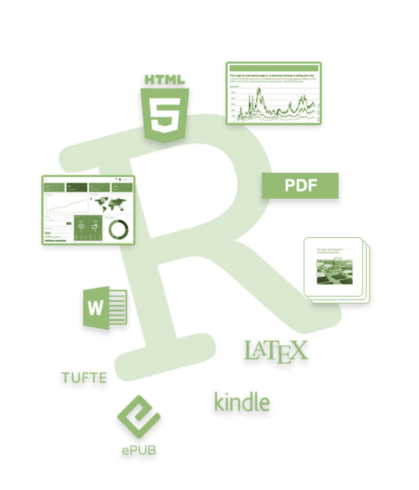

    
Using RMarkdown
========================================================
author: Cory Whitney
font-family: 'Helvetica'
date: "2019-03-12"
autosize: true
css: mySlideTemplate.css
incremental: true
right: 40%
***

RMarkdown: overview
========================================================
incremental: true

***
- Use it! 
- You will thank yourself 
- Save often with new version
- Or use git

</small>https://rmarkdown.rstudio.com/ </small>

