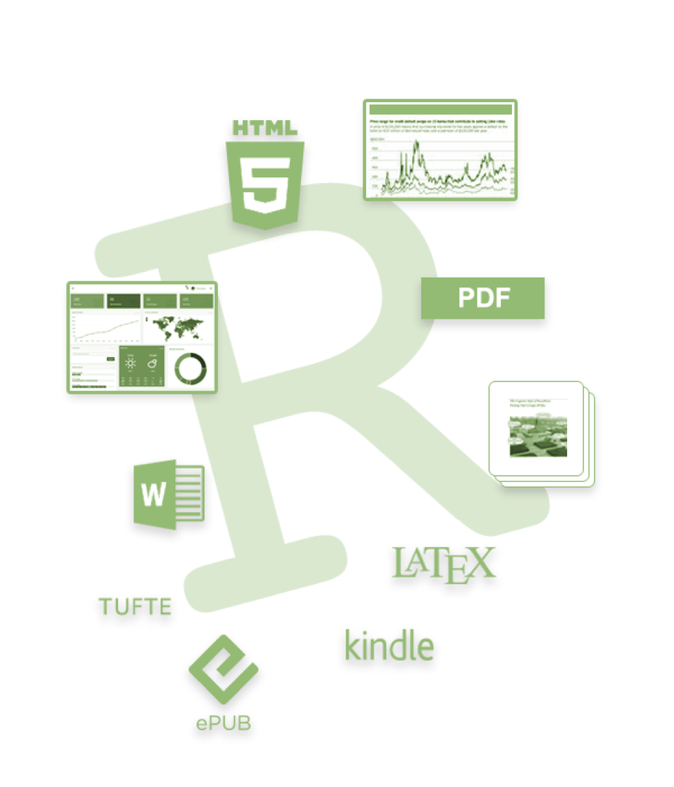
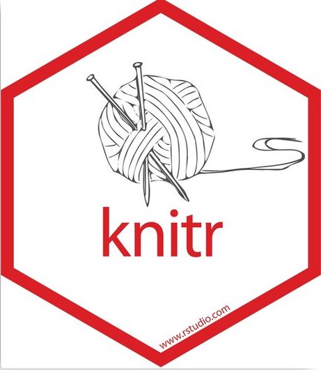
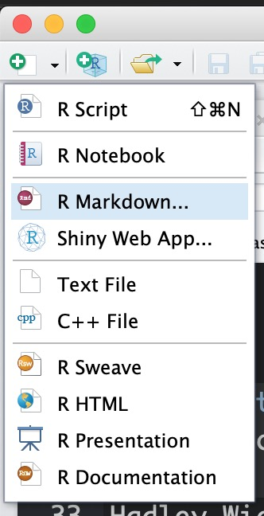

    
Using RMarkdown
========================================================
author: Cory Whitney
font-family: 'Helvetica'
width: 1920
height: 1080
css: mySlideTemplate.css

</small>cory.whitney@uni-bonn.de </small>

RMarkdown: overview
========================================================
incremental: true

***
- Use it! 
- You will thank yourself 
- Save often with new version
- Or use git

</small>https://rmarkdown.rstudio.com/ </small>

RMarkdown: getting stuck
========================================================
incremental: true
right: 30%

- Use a ‘?’ with function, package, data name in the R console
- If you get stuck, use Google: just add “R” to a search e.g. a copy of an error message
- Someone else has also been confused by it and has written about it
- Thousands of talented programmers who scan the web and answer these problems

</small>https://stackoverflow.com/ </small>

***

Hadley Wickham

Yihui Xie

<small>https://rmarkdown.rstudio.com/ </small>

RMarkdown: basics
========================================================
incremental: true

-Markdown Basics

<small>https://rmarkdown.rstudio.com/authoring_basics.html</small>

<small>https://bookdown.org/yihui/rmarkdown/r-code.html</small>

- open RStudio

***

- open a markdown file

- Use the setup chunk
- Remember the Table of Contents

