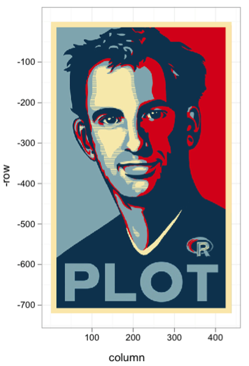

Data Wrangling
========================================================
author: Cory Whitney
font-family: 'Helvetica'
date: "2019-03-09"
autosize: true
***


Overview
====================================
incremental: true


***
- Tidy code style with tidyR  
- Clean and intuitive functions with dplyr
- Concise code with magrittr 'Ceci n'est pas une pipe'

Notes on R
========================================================
incremental: true

Left-brained, paint in your hair experience


Andrew MacDonald @polesasunder http://thestudyofthehousehold.com/2018/02/09/2018-02-09-how-i-use-rmarkdown/

Notes on R
========================================================


Notes on R
========================================================
incremental: true
Keep it tidy  http://style.tidyverse.org/

Use ‘#’ to annotate and not run

If not Rmarkdown then at least use ‘----’ or ‘####’ 

#Section 1----

#Section 2####

#Section 3####

<span style="font-weight:bold; color:red;">TOC in upper right console</span>


Notes on R 
========================================================
incremental: true
Keep it tidy  http://style.tidyverse.org/


```r
browseVignettes(package = "tidyverse")
```

***
  
Hadley Wickham

Notes on R 
========================================================
incremental: true
Keep it tidy  http://style.tidyverse.org/


Good coding style is like correct punctuation:
withoutitthingsarehardtoread

Notes on R 
========================================================
incremental: true
Keep it tidy  http://style.tidyverse.org/

- Keep your data tidy
- When your data is tidy, each column is a variable, and each row is an observation
- Consistent structure lets you focus your struggle on questions about the data, not fighting to get the data into the right form for different functions


Notes on R 
========================================================
incremental: true

'Tidy Data' in the Journal of Statistical Software http://www.jstatsoft.org/v59/i10/paper.

Three things make a dataset tidy:
- Each variable with its own column.
- Each observation with its own row.
- Each value with its own cell.


Wrangling 
========================================================
incremental: true

- Once you have __tidy__ data, a common first step is to __transform__ it
- narrowing in on observations of interest
- creating new variables that are functions of existing variables
- calculating a set of summary statistics

 http://www.codeastar.com/data-wrangling/

Wrangling 
========================================================
incremental: true


***
Format of __dplyr__ by H. Wickham
- __Arguments start with a data frame__
- __select__: return a subset of the columns
- __filter__: extract a subset of rows
- __arrange__: reorder rows
- __rename__: rename variables
- __mutate__: add new variables and columns or transform
- __summarize__: generate summary statistics

Wrangling 
========================================================
incremental: true
- Using __dplyr__ 


```r
# install.packages("dplyr")
library(dplyr)
```
***


Roger Peng genomicsclass.github.io/ book/pages/ dplyr_tutorial


Wrangling 
========================================================
incremental: true
Subsetting 

__Select__


```r
aca_work_filter<-select(participants_data, academic_parents, working_hours_per_day)
aca_work_filter
```

```
  academic_parents working_hours_per_day
1                N                     8
2                Y                     8
3                N                     7
4                Y                    16
5                N                    12
6                N                    16
7                N                     3
8                N                     8
9                Y                     9
```

```r
non_aca_work_filter<-select(participants_data, -academic_parents, -working_hours_per_day)
non_aca_work_filter
```

```
  age gender continent_of_origin research_continent number_of_publications
1  33      F              Europe             Europe                      6
2  31      F       South America      South America                      0
3  30      F       South America      South America                      1
4  28      M              Africa             Africa                      1
5  30      M              Africa             Africa                      3
6  30      M              Africa             Africa                      3
7  33      F              Africa             Africa                      0
8  30      F       South America      South America                      2
9  27      M              Europe             Europe                      0
  number_of_siblings km_home_to_zef years_of_study days_to_email_response
1                  1            1.7             20                      1
2                  2           40.0              9                      1
3                  2        10370.0              7                      1
4                  1           15.0              3                      1
5                  5            6.0              7                      1
6                  4            8.3             10                      2
7                  7            9.0              6                      2
8                  1           65.0              7                      2
9                  2            1.0              6                      3
  letters_in_first_name
1                     4
2                     6
3                     7
4                     7
5                     6
6                     6
7                     5
8                     7
9                     5
```
***
__Base R alternative__


```r
aca_work<-participants_data[, c(8, 6)]
aca_work
```

```
  academic_parents working_hours_per_day
1                N                     8
2                Y                     8
3                N                     7
4                Y                    16
5                N                    12
6                N                    16
7                N                     3
8                N                     8
9                Y                     9
```

```r
non_aca_work<-participants_data[, c(8, 6)]
non_aca_work
```

```
  academic_parents working_hours_per_day
1                N                     8
2                Y                     8
3                N                     7
4                Y                    16
5                N                    12
6                N                    16
7                N                     3
8                N                     8
9                Y                     9
```

Wrangling 
========================================================
incremental: true
Subsetting 

__Filter__

```r
work_filter<-filter(participants_data, working_hours_per_day >10)
work_filter
```

```
  age gender continent_of_origin research_continent number_of_publications
1  28      M              Africa             Africa                      1
2  30      M              Africa             Africa                      3
3  30      M              Africa             Africa                      3
  working_hours_per_day number_of_siblings academic_parents km_home_to_zef
1                    16                  1                Y           15.0
2                    12                  5                N            6.0
3                    16                  4                N            8.3
  years_of_study days_to_email_response letters_in_first_name
1              3                      1                     7
2              7                      1                     6
3             10                      2                     6
```

```r
work_name_filter<-filter(participants_data, working_hours_per_day >10 & letters_in_first_name >6)
work_name_filter
```

```
  age gender continent_of_origin research_continent number_of_publications
1  28      M              Africa             Africa                      1
  working_hours_per_day number_of_siblings academic_parents km_home_to_zef
1                    16                  1                Y             15
  years_of_study days_to_email_response letters_in_first_name
1              3                      1                     7
```

Wrangling 
========================================================
incremental: true


__Rename__


```
Error in .f(.x[[i]], ...) : object 'letters_in_first_name' not found
```
